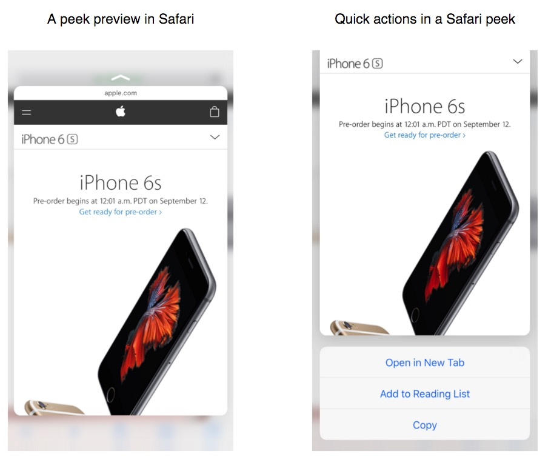

#3D Touch

3D Touch为iOS9用户提供了额外的交互方式.在支持的设备上,用户可以通过按压主屏幕上应用的图标来快速的选择应用特定的动作。再App内部，用户可以使用多种不同力度的按压来获取条目的预览、在另一个view中打开条目或者执行相关的操作。

##Peek and Pop

Peek让用户可以预览一个条目,同时在不离开当前上下文的情况下可以执行相关联的动作。一个条目支持Peek的标志是当轻轻的按压屏幕的时候会出现一个小的矩形视图。

###Peek:

* 当用户按压支持peek的视图是出现,当手指抬起的时候消失
* 当用户稍微重一点的按压peek视图的时候打开这个条目的详细视图(Pop)
* 当用户在peek视图中网上滑动的时候可以提供与条目关联的快速动作

当用户轻轻的按压屏幕的时候，支持Peek的视图会通过展示一个你提供的矩形视图提示还有进一步的操作可用。

https://developer.apple.com/library/prerelease/ios/documentation/UserExperience/Conceptual/MobileHIG/3DTouch.html#//apple_ref/doc/uid/TP40006556-CH71-SW1

https://developer.apple.com/library/prerelease/ios/documentation/UserExperience/Conceptual/Adopting3DTouchOniPhone/3DTouchAPIs.html#//apple_ref/doc/uid/TP40016543-CH4-SW1