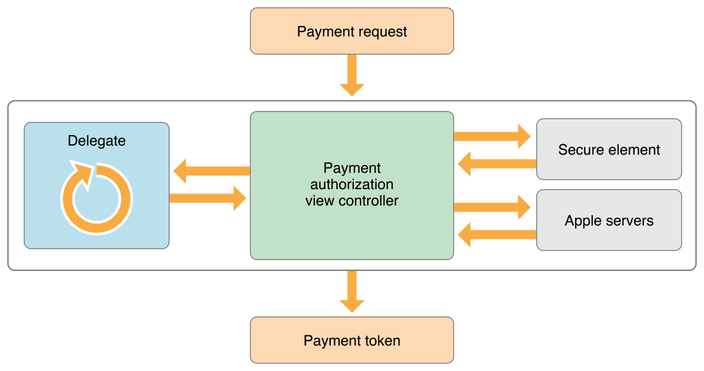
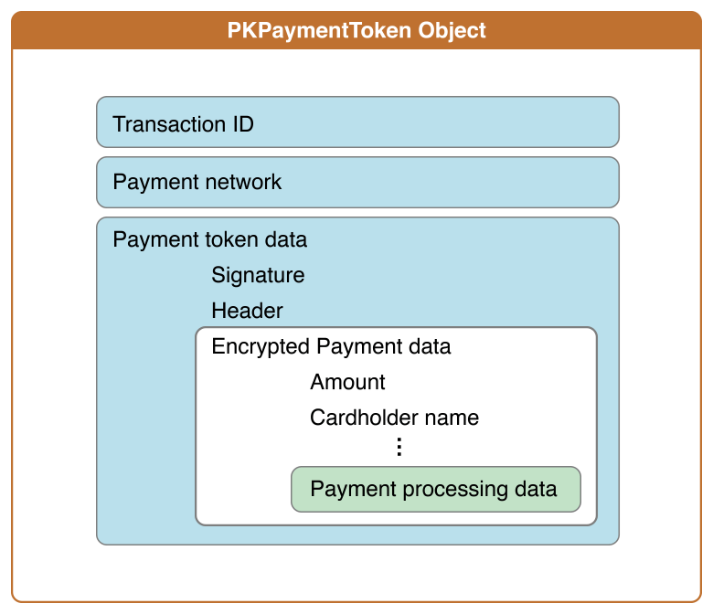

#Apple Pay
-

###关于 Apple Pay
使用 Apple Pay 的应用需要在 Xcode 中启用 Apple Pay 功能。首先，你需要注册一个商家 ID 并生成一个加密密钥。这个密钥用于加密发送至服务器的支付信息。





你的应用创建一个支付请求并初始化支付环境。这个支付请求包括了所支付的商品或者服务的小计、额外的税、运费或折扣的信息。将这个请求发送给给支付认证视图控制器 (Payment authorization view controller)。该视图控制器将该支付请求展示给用户并提示用户输入所需的必要信息，例如配送地址或者账单寄送地址等。当用户与视图控制器交互时，你的委托 (Delegate) 会被调用以更新该支付请求。

当用户授权支付后，Apple Pay 会加密支付信息以防止非授权第三方访问该信息。在设备上，Apple Pay 将支付请求会送至安全模块 （Secure element）处理。安全模块是位于用户设备上的一个专用芯片。它使用 你的商家信息、支付数据以及所使用的银行卡进行计算，生成一个加密支付令牌。随后，安全模块会将该令牌发送至 Apple 的服务器。此服务器会使用你的商家 ID 对应的 证书重新加密支付令牌。最后，服务器将它发送至应用处理。

支付令牌不会被存储于 Apple 的服务器上，服务器只是简单地使用你的证书重新加密你的支付令牌。这样一个支付过程使得无需将商家 ID 对应的证书随着应用一起发布，同时可以保证应用程序可以安全地加密用户的支付信息。

关于 Apple Pay 的安全性的更多内容请参考 《iOS 安全性指南》

绝大多数情况下，你的应用程序会将加密后的支付令牌发送至第三方的支付平台以完成支付过程。然而，如果你的团队有自己的支付平台，你可以在自己的服务器上解密然后处理自己的支付业务。


###配置你的开发环境

Apple Pay 中的 __MerchantID__ 用于标识你能够接受付款。与商家 ID 相关联的公钥与证书用于在支付过程中加密支付信息。要想使用 Apple Pay，你首先需要注册一个商家 ID 并且配置它的证书。

####本地先生成一个CSR文件备用，用于申请证书。


####注册MerchantID
######登录苹果开发者中心,在Identifiers下选择Merchant IDs，点击右上角添加按钮添加Merchant ID,输入描述信息和标识符,点击继续
-


######这是刚才的信息的确认，没问题下一步，有问题back（返回）进行修改
-


######MerchantID申请完成
-


####申请证书

-
######下面的就是创建证书了，除了下面的点击编辑进行创建证书外，还可以在Certificate 下创建一个Production-Apple Pay Certificate进行创建。


-
######如果需要在非美国使用Apple Pay，需要打开权限

-
######点击下一步会需要CSR文件，可以使用刚开始创建好的CSR文件。

-
######选择CSR文件

-
######下载


####开启项目的Apple Pay服务(Xcode中同样可以开启,不过我们只有主账号有这个权限)

######APPID列表，选择我们创建的APPID点击编辑，对Applepay进行配置
-

######找到下面Applepay进行配置
-

######选择应用要使用的merchantID，为什么可以多选？
-

######分配
-


##创建支付请求

支付请求是 PKPayementRequest 类的一个实例。一个请求包含用户支付的物品概要清单、可选配送方式列表、用户需提供的配送信息、商家的信息以及支付处理机构。

#####判断用户是否能够支付

创建支付请求前，可以先通过调用 `PKPaymentAuthorizationViewController` 类的方法 `canMakePaymentsUsingNetworks` 判断用户是否能使用你支持的支付网络完成付款。`canMakePayments` 方法可以判断当前设备的硬件是否支持 Apple Pay 以及家长控制是否允许使用 Apple Pay。

如果 `canMakePayments` 返回 NO，则设备不支持 Apple Pay。不要显示 Apple Pay按扭，你可以选择使用其它的支付方式。

如果 `canMakePayments` 返回 YES，但 `canMakePayementsUsingNetworks:` 返回 NO，则表示设备支持 Apple Pay，但是用户并没有为任何请求的支付网络添加银行卡。你可以选择显示一个支付设置按扭，引导用户添加银行卡。如果用户点击该按扭，则开始设置新的银行卡流程 (例如，通过调用 openPaymentSetup 方法)。

一旦按下 Apple Pay 按扭，你就开始支付授权过程。在显示支付请求之前不要让用户进行任何其它操作。例如，如果用户需要输入优惠码，你应该在用户按下 Apple Pay 按扭之前要求用户输入该优惠码。

```
在 iOS 8.3 以及以后的系统中，你可以选择使用 PKPayementButton 方法在
初始化支付请求时创建带商标的 Apple Pay 按扭。
```


####桥接基于 web 的支付接口

如果应用使用的是基于 web 的接口进行商品或服务的支付，那么你在处理 Apple Pay 事务之前你需要将 web 接口的请求发送至 iOS 本地代码。列表 3-1 展示了处理来自 web 视图的付款请求步骤：

```

// Called when the web view tries to load "myShoppingApp:buyItem"
-(void)webView:(nonnull WKWebView *)webView
decidePolicyForNavigationAction:(nonnull WKNavigationAction *)navigationAction
decisionHandler:(nonnull void (^)(WKNavigationActionPolicy))decisionHandler {

    // Get the URL for the selected link.
    NSURL *URL = navigationAction.request.URL;

    // If the scheme and resource specifier match those defined by your app,
    // handle the payment in native iOS code.
    if ([URL.scheme isEqualToString:@"myShoppingApp"] &&
        [URL.resourceSpecifier isEqualToString:@"buyItem"]) {

        // Create and present the payment request here.

        // The web view ignores the link.
        decisionHandler(WKNavigationActionPolicyCancel);
    }

    // Otherwise the web view loads the link.
    decisionHandler(WKNavigationActionPolicyAllow);
}

```

###包含货币以及地区信息的支付请求


在同一个支付请求中的所有汇总金额使用相同的货币。所使用的币种可以通过 `PKPaymentRequest` 的 `currencyCode` 属性指定。币种由三个字符的 ISO 货币代码指定，例如 USD 表示美元。

支付请求中的国家代码表明支付发生的国家或者支付将在哪个国家处理。由两个字符的 ISO 国家代码指定该属性，例如 US。

在请求中指定的商户ID必须是应用程序有授权的商户ID中的某一个。

```
request.currencyCode = @"USD";
request.countryCode = @"US";
request.merchantIdentifier = @"merchant.com.example";

```

###支付请求包括一系列的支付汇总项

由 `PKPaymentSummaryItem` 类表示支付请求中的不同部分。一个支付请求包括多个支付汇总项，一般包括：小计、折扣、配送费用、税以及总计。如果你没有其它任何额外的费用 (例如，配送或税)，那么支付的总额直接是所有购买商品费用 的总和。关于每一项商品的费用的详细信息你需要在应用程序的其它合适位置显示。

每一个汇总项都有标签和金额两个部分。标签是对该项的可读描述。金额对应于所需支付的金额。一个支付请求中的所有金额都使用该请求中指定的支付货币类型。对于折扣和优惠券，其金额被设置为负值。

某些场景下，如果在支付授权的时候还不能获取应当支付的费用(例如，出租车收费)，则使用 `PKPaymentSummaryItemTypePending` 类型做小计项，并将其金额值设置为 0.0。系统随后会设置该项的金额值。

```
// 12.75 subtotal
NSDecimalNumber *subtotalAmount = [NSDecimalNumber decimalNumberWithMantissa:1275 exponent:-2 isNegative:NO];
self.subtotal = [PKPaymentSummaryItem summaryItemWithLabel:@"Subtotal" amount:subtotalAmount];

// 2.00 discount
NSDecimalNumber *discountAmount = [NSDecimalNumber decimalNumberWithMantissa:200 exponent:-2 isNegative:YES];
self.discount = [PKPaymentSummaryItem summaryItemWithLabel:@"Discount" amount:discountAmount];

```
注意:


___汇总项使用 NSDecimalNumber类存储金额，并且金额使用10进制数表示。如示例代码演示的一样可以通过显示地指定小数部分与指数部分创建该类的实例，也可以直接使用字符串的方式指定金额。在财务计算中绝大部分情况下都是使用的 10 进制数进行计算的，例如，计算 5% 的折扣。___

___尽管 IEEE 浮点数 float 或 double 计算更加方便一些，但是它们并不适用于财务计算中，因为这些数字使用 2 进制表示。这意味着有些符点数不能被准确的表示，例如 0.42 只能被近似的表示为 0.41999...。这样的近似可能导致财务计算返回错误的结果。___


汇总项列表中最后一项是总计项。总计项的金额是其它所有汇总项的金额的和。总计项的显示不同用于其它项。在该项中，你应该使用你的公司名称作为其标签，使用所有其它项的金额之和作为其金额值。最后，使用 `paymentSummaryItems` 属性将所有汇总项都添加到支付请求中。

```

// 10.75 grand total
NSDecimalNumber *totalAmount = [NSDecimalNumber zero];
totalAmount = [totalAmount decimalNumberByAdding:subtotalAmount];
totalAmount = [totalAmount decimalNumberByAdding:discountAmount];
self.total = [PKPaymentSummaryItem summaryItemWithLabel:@"My Company Name" amount:totalAmount];

self.summaryItems = @[self.subtotal, self.discount, self.total];
request.paymentSummaryItems = self.summaryItems;

```


###配送方式是一个特殊的支付汇总项

为每一个可选的配送方式创建一个 PKShippingMethod 实例。与其它支付汇总项一些，配送方式也有一个用户可读的标签，例如标准配送或者可隔天配送，和一个配送金额值。与其它汇总项不同的时，配送方法有一个 detail 属性值，例如，7 月 29 日送达或者 24 小时之内送达等等。该属性值说明不同配送方式之间的区别。

为了在委托方法中区分不同的配送方式，你可以使用 identifier 属性。这个属性只被该应用使用，它对于支付框架是不可见。同样，它也不会出现在 UI 中。在创建每个配送方式的时候为其分配一个唯一的标识符。为了便于调试，推荐使用简短字符串或者字符串缩写，例如 “discount”、“standard”、“next-day” 等等。

有些配送方式并不是在所有地区都是可以使用的，或者它们费用会根据配送地址的不同而发生变化。你需要在用户选择配送地址或方法时更新其信息，详情请见 委托方法更新配送方法与费用。

```

//设置配送方式
    PKShippingMethod *shipingOne = [PKShippingMethod summaryItemWithLabel:@"包邮"
    									  amount:[NSDecimalNumber zero]];
    shipingOne.identifier = @"shipingOne";
    shipingOne.detail = @"免费送货,但是速度超慢";
    PKShippingMethod *shipingTwo = [PKShippingMethod summaryItemWithLabel:@"包邮" 
    									  amount:[NSDecimalNumber decimalNumberWithMantissa:1000
    									  exponent:-2 isNegative:NO]];
    shipingTwo.identifier = @"shipingOne";
    shipingTwo.detail = @"免费送货,但是速度超慢";
    paymentRequest.shippingMethods = @[shipingOne,shipingTwo];

```


###指定应用程序支持的支付处理机制

supportedNetworks 属性是一个字符串常量，通过设置该值可以指定应用所支持的支付网络。 merchantCapabilities 属性值说明应用程序支持的支付处理协议。3DS 协议是须支持的支付处理协议， EMV 是可选的支付处理协议。

```

request.supportedNetworks = @[PKPaymentNetworkAmex,
                              PKPaymentNetworkDiscover,
                              PKPaymentNetworkMasterCard, 
                              PKPaymentNetworkVisa];

// Supports 3DS only
request.merchantCapabilities = PKMerchantCapability3DS;

// Supports both 3DS and EMV
request.merchantCapabilities = PKMerchantCapability3DS | PKMerchantCapabilityEMV;

```

####说明所需的配送信息和账单信息

修改支付授权视图控制器的 requiredBillingAddressFields 属性和 requiredShippingAddressFields 属性可以设置所需的账单信息和配送信息。当你显示视图控制器时，它会提示用户输入必需的账单信息和配送信息。这个域的值是通过这些属性组合而成的，如下所示：

```
//Email Only
request.requiredBillingAddressFields = PKAddressFieldEmail;
//
request.requiredBillingAddressFields = PKAddressFieldEmail |
											   PKAddressFieldPostalAddress |
											   PKAddressFieldPhone |
											   PKAddressFieldName;

```

如果已有最新账单信息以及配送联系信息，你可以直接为支付请求设置这些值。 Apple Pay 会默认使用这些信息。但是，用户仍然可以选择在本次支付中使用其它联系信息。

```

PKContact *contact = [[PKContact alloc] init];

NSPersonNameComponents *name = [[NSPersonNameComponents alloc] init];
name.givenName = @"John";
name.familyName = @"Appleseed";

contact.name = name;

CNMutablePostalAddress *address = [[CNMutablePostalAddress alloc] init];
address.street = @"1234 Laurel Street";
address.city = @"Atlanta";
address.state = @"GA";
address.postalCode = @"30303";

contact.postalAddress = address;

request.shippingContact = contact;

```

###保存其它信息
保存支付中其它与应用相关的信息，例如购物车标识，你可以使用 applicationData 属性。这个属性对于系统来说是不可见的。用户授权支付后，应用数据的哈希值也会成为支付令牌的一部分。


##授权支付

支付授权过程是由支付授权视图控制器与其委托合作完成的。支付授权视图控制器做了两件事：

* 让用户选择支付请求所需的账单信息与配送信息。
* 让用户授权支付操作。

用户与视图控制器交互时，委托方法会被系统调用，所以在这些方法中你的应用可以更新所要显示的信息。例如在配送地址修改后更新配送价格。在用户授权支付请求后此方法还会被调用一次。

__在实现这些委托方法时，你应该谨记它们会被多次调用并且这些方法调用的顺序是取决与用户的操作顺序的。__


所有的这些委托方法在授权过程中都会被调用，传入该方法的其中一个参数是一个完成块 (completion block)。支付授权视图控制器等待一个委托完成相应的方法后 (通过调用完成块) 再依次调用其它的委托方法。`paymentAuthorizationViewControllerDidFinish: `方法是唯一例外：它并不需要一个完成块作为参数，它可以在任何时候被调用。

完成块接受一个输入参数，该参数为应用程序根据信息判断得到的支付事务的当前状态。如果支付事务一切正常，则应传入值 `PKPaymentAuthorizationStatusSuccess`。否则，可以传入能识别出错误的值。

创建 `PKPaymentAuthorizationViewController` 类的实例时，你需要将已初始化后的`PKPaymentRequest`对象传递给视图控制器初始化函数。接着，设置视图控制器的委托；然后再显示它：


```
PKPaymentAuthorizationViewController *viewController = [[PKPaymentAuthorizationViewController alloc]
												               initWithPaymentRequest:request];
if (!viewController) { /* ... Handle error ... */ }
viewController.delegate = self;
[self presentViewController:viewController animated:YES completion:nil];

```

###使用委托方法更新配送方式与配送费用


当用户输入配送信息时，授权视图控制器会调用委托的
`paymentAuthorizationViewController:didSelectShippingContact:completion: `
方法和 
`paymentAuthorizationViewController:didSelectShippingMethod:completion:`
 方法。你可以实现这两个方法来更新你的支付请求。
 
 
 ```
 
 - (void) paymentAuthorizationViewController:(PKPaymentAuthorizationViewController *)controller
                   didSelectShippingContact:(CNContact *)contact
                   completion:(void (^)(PKPaymentAuthorizationStatus, NSArray *, NSArray *))completion
{
    self.selectedContact = contact;
    [self updateShippingCost];
    NSArray *shippingMethods = [self shippingMethodsForContact:contact];
    completion(PKPaymentAuthorizationStatusSuccess, shippingMethods, self.summaryItems);
}

- (void) paymentAuthorizationViewController:(PKPaymentAuthorizationViewController *)controller
                    didSelectShippingMethod:(PKShippingMethod *)shippingMethod
                    completion:(void (^)(PKPaymentAuthorizationStatus, NSArray *))completion
{
    self.selectedShippingMethod = shippingMethod;
    [self updateShippingCost];
    completion(PKPaymentAuthorizationStatusSuccess, self.summaryItems);
}
 
 ```
 
 ___为了保护用户隐私，提供给方法 paymentAuthorizationViewController:didSelectShippingContact:completion: 的配送信息是经过匿名化处理后的数据。返回的 contact 包含了计算配送费用的所有信息同时隐藏了用户的敏感信息。只有在用户授权支付后，你才能得到用户完整的配送信息。此外， contact 中的数据会随着国家的不同而不同，同时还会随着版本的更新而变化。请仔细测试你的应用程序。___
 
 
###支付被授权时创建了一个支付令牌


当用户授权一个支付请求时，支付框架的 Apple 服务器与安全模块会协作创建一个支付令牌。你可以在委托方法 `paymentAuthorizationViewController:didAuthorizePayment:completion: `中将支付信息以及其它你需要处理的信息，例如配送地址和购物车标识符，一起发送至你的服务器。这个过程如下所示：

* 支付框架将支付请求发送至安全模块。只有安全模块会访问令牌化后的设备相关的支付卡号。
* 安全模块将特定卡的支付数据和商家信息一起加密(加密后的数据只有 Apple 可以访问)，然后将加密后的数据发送至支付框架。支付框架再将这些数据发送至 Apple 的服务器。
* Apple 服务器使用商家标识证书将这些支付数据重新加密。这些令牌只能由你以及那些与你共享商户标识证书的人读取。随后服务器生成支付令牌再将其发送至设备。
* 支付框架调用 `paymentAuthorizationViewController:didAuthorizePayment:completion:` 方法将令牌发送至你的委托。你在委托方法中再将其发送至你的服务器。

在服务器上的处理操作取决于你是自己处理支付还是使用其它支付平台。不过，在两种情况下服务器都得处理订单再将处理结果返回给设备。在设备上，委托再将处理结果传入完成处理方法中.


```

- (void) paymentAuthorizationViewController:(PKPaymentAuthorizationViewController *)controller
                        didAuthorizePayment:(PKPayment *)payment
                        completion:(void (^)(PKPaymentAuthorizationStatus))completion
{
    NSError *error;
    ABMultiValueRef addressMultiValue = ABRecordCopyValue(payment.billingAddress, 
    											                  kABPersonAddressProperty);
    											                  
    NSDictionary *addressDictionary
     = (__bridge_transfer NSDictionary *) ABMultiValueCopyValueAtIndex(addressMultiValue, 0);
     
    NSData *json = [NSJSONSerialization dataWithJSONObject:addressDictionary 
    	                                 options:NSJSONWritingPrettyPrinted error: &error];

    // ... Send payment token, shipping and billing address, and order information to your server ...

    PKPaymentAuthorizationStatus status;  // From your server
    completion(status);
}

```

###委托方法中释放支付授权视图控制器

支付框架显示完支付事务状态后，授权视图控制器会调用委托的 aymentAuthorizationViewControllerDidFinish: 方法。在此方法的实现中，你应该释放授权视图控制器然后再显示与应用相关的支付信息界面。

```

- (void) paymentAuthorizationViewControllerDidFinish:(PKPaymentAuthorizationViewController *)controller
{
    [controller dismissViewControllerAnimated:YES completion:nil];
}

```


###处理支付

处理一次付款事务一般包括以下几个步骤：

1. 将付款信息与其它处理订单的必需信息一起发送至你的服务器。
2. 验证付款数据的散列值与签名。
3. 解密出支付数据。
4. 将支付数据提交给付款处理网络。
5. 将订单信息提交至你的订单跟踪系统。


	你有两种可选的方式处理付款过程:
   * 利用已有的支付平台来处理付款。 
   * 自己实现付款过程。一次付款的处理过程通常情况下包括上述的大部分步骤。

访问、验证以及处理付款信息都需要你懂得一些加密领域的知识，比如 SHA-1 哈希、访问和验证 PKCS #7 签名以及如何实现椭圆曲线 Diiffie-Hellman 密钥交换等。如果你没有这些加密的背景知识，我们建议你使用已有支付平台，它们会替你完成这些繁琐的操作。关于 Apple Pay 已支持的第三方支付平台，请参考 developer.apple.com/apple-pay/.。

如图 5-1 所示，付款数据是嵌套结构。支付令牌是 PKPaymentToken 类的实例。其 paymentData 属性值是一个 JSON 字典。该 JSON 字典包括用于验证信息有效性头信息以及加密后的付款数据。加密后的支付数据包括付款金额、持卡人姓名以及其它特定支付处理协议的信息。

