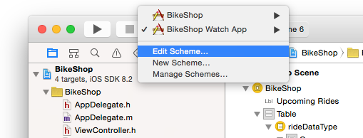
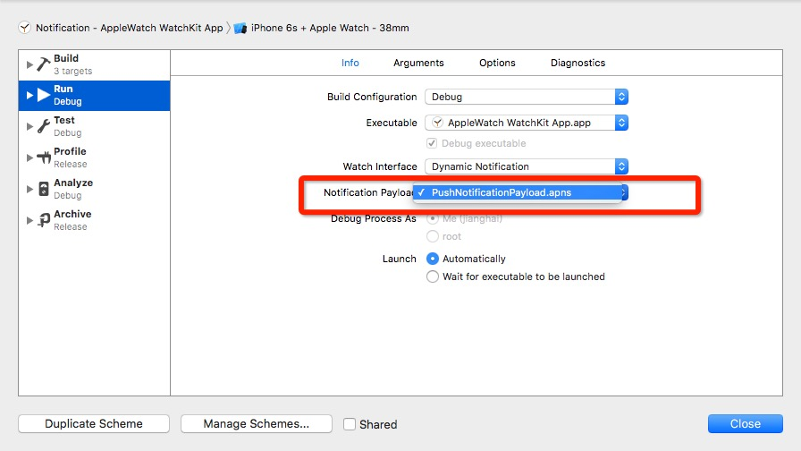
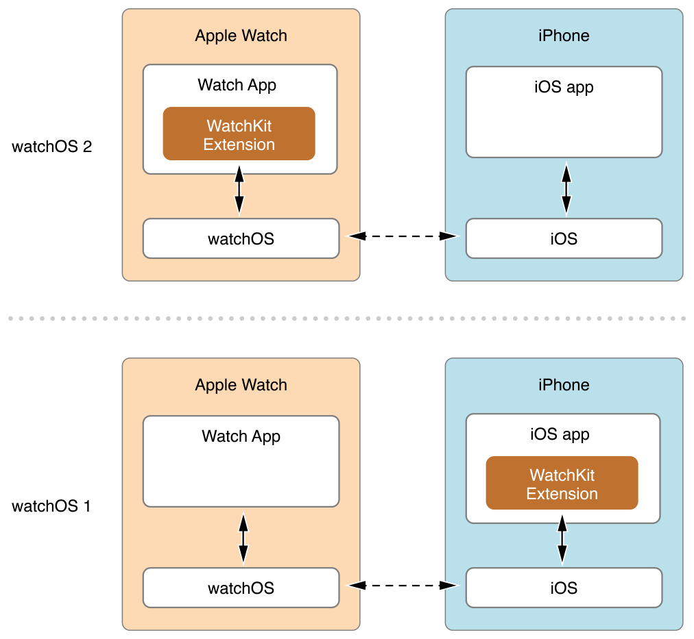
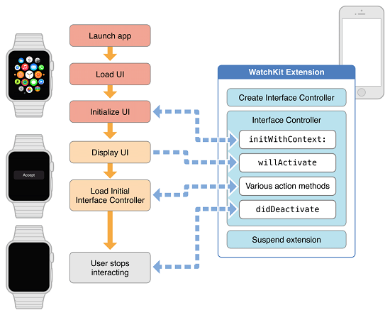

#WatchKit Programming Guide

#overView
   AppleWatch应用由两个独立的部分组成：a Watch app and a WatchKit extension. 
   WatchKit Extension 包含了管理接口、响应用户交互和更新用户接口的代码。
   watchOS1和watchOS变化比较大，watchOS1中watchKit extension运行在iPhone上watchOS2中移到了AppleWatch上了。
   
##Developing for Apple Watch

###The Glance Interface
Glance是一个用于呈现app重要信息的接口,app中不是必须有glance，但是如果有相关信息需要展示可能会包含有。glance是非滚动的,整个glance视图必须适配在一个单独的屏幕，glance中的信息是只读的，因此glance不包含按钮、开关或者其他可交互的控件。点击glance会运行你的WatchApp。

glance不是单独可执行的，而是app的一部分。glance位于你WatchApp的storyboard中,配置glance的代码在WatchKit extension中。更行glance的方法和创建WatchApp的方法一致。

###远程通知和本地通知

AppleWatch和iPhone配对工作来展示本地和远程通知。AppleWatch使用一个很小的界面(叫做short look)来展示即将接受到通知。当用户想查看更多的信息，可以使用一个更加详细的界面(叫做long look).你也可以自定义与系统提供的不同的详细界面(通知数据的图像、排序)。

AppleWatch在iOS8中自动的提供了对可操作的通知的支持，可操作的通知是一种添加按钮到你的通知界面的方式，它反映了用户可能需要的操作。例如，一个会议邀请的通知可能包含接受或者拒绝邀请的按钮.AppleWatch会自动的添加适当的按钮到通知的视图中,你所需要做的是在WatchKit extension中处理用户选择的这些动作。

###Complications

Complications是一个出现在watch表盘向用户展示重要信息的小型可见节点。Complications当用户查看时间的时候变得可见。大多数watch支持至少两个或者三个Complications，用户可以自定义哪些Complications被显示，App可以使用一个Complication来展示特别的app数据。

###设计你的用户界面

AppleWatch的本质决定了Applewatch需要不同的设计。在AppleWatch开发中，你的用户界面需要快速的展示信息，方便的导航。要创建这类界面意味着你不能简单的将现有的iOS app表现方式使用在AppleWatch上。相反的你的iOS app需要配套的AppleWatch用户界面。

##配置你的Xcode工程

一个AppleWatch app需要一个存在的iOS app。Xcode会将Watch应用和WatchKit应用扩展打包，然后放进现有的iOS应用包中。Xcode提供了一个搭建Watch应用的模板，其中包含了创建应用、glance，以及自定义通知界面所需的所有资源。该模板在现有的iOS应用中创建一个额外的Watch应用对象。（WatchKit development requires the iOS 8.2 SDK or later. ）

iOS模拟器为你提供了运行环境，你可以用来测试你的AppleWatch app。

###向iOS应用中添加Watch应用

要向现有项目中添加Watch应用对象，请执行以下操作：

1. 打开现有的iOS应用项目
2. 选择 File > New > Target，然后选中Apple Watch
3. 选择 Watch App
4. 单击 Next
5. 如果您想要使用glance或者自定义通知界面，请选择相应的选项

建议激活应用通知选项。选中之后就会创建一个新的文件来调试该通知界面。如果您没有选择这个选项，那么之后您只能手动创建这个文件了。

6. 单击 Finish

完成上述操作之后，Xcode将WatchKit应用扩展所需的文件以及Watch应用添加到项目当中，并自动配置相应的对象。Xcode将基于iOS应用的bundle ID来为两个新对象设置它们的bundle ID。比如说，iOS应用的bundle ID为`com.example.MyApp`，那么Watch应用的bundle ID将被设置为`com.example.MyApp.watchapp`，WatchKit应用扩展的bundle ID被设置为`com.example.MyApp.watchkitextension`。这三个可执行对象的基本ID（即`com.example.MyApp`）必须相匹配，如果您更改了iOS应用的bundle ID，那么您就必须相应的更改另外两个对象的bundle ID。
###应用对象的结构

Xcode中的WatchKit应用扩展模板为iOS应用创建了两个新的可执行程序。Xcode同时也配置了项目的编译依赖，从而让Xcode在编译iOS应用的同时也编译这两个可执行对象。图2-1说明了它们的依赖关系，并解释了Xcode是如何将它们打包在一起的。WatchKit依赖于iOS应用，而其同时又被Watch应用依赖。编译iOS应用将会将这三个对象同时编译并打包。
 
###编译、运行以及调试程序

当您创建完Watch应用对象后，Xcode将自行配置用于运行和调试应用的编译方案。使用该配置在iOS模拟器或真机上启动并运行您的应用。

对于包含glance或者自定义通知的应用来说，Xcode会分别为其配置不同的编译方案。使用glance配置以在模拟器中调试glance界面，使用通知配置以测试静态和动态界面。

为glance和通知配置自定义编译方案

1. 选择现有的Watch应用方案
2. 从方案菜单中选择Edit Scheme

	

3. 复制现有的Watch应用方案，然后给新方案取一个合适的名字。
比如说，命名为“Glance - My Watch app”，表示该方案是专门用来运行和调试glance。
4. 选择方案编辑器左侧栏的Run选项
5. 在信息选项卡中，选择合适的可执行对象
6. 关闭方案编辑器以保存更改
>
	watch OS2中自动生成的。

###通知

当您在iOS模拟器调试自定义通知界面的时候，您可以指定一个负载来模拟进来的通知。通知界面的Xcode模板包含一个__RemoteNotificationPayload.json(watch OS1)/PushNotificationPayload.apns(watch OS2)__文件，您可以用它来指定负载中的数据。这个文件位于WatchKit应用扩展的Supporting Files文件夹。只有当您在创建Watch应用时勾选了通知场景选项，这个文件才会被创建。如果这个文件不存在，您可以用一个新的空文件手动创建它。

负载文件包含了绝大多数您需要的键值，但是您可以根据应用程序的实际情况添加更多的键值。图2-2展示了项目中的默认JSON文件。由于iOS模拟器无法访问iOS应用的注册动作，这个负载便包含了一个名为“WatchKit Simulator Actions”的键值，其值为一个包含了一系列动作的数组。每个动作按钮含有`title`和`identifier`键，它们的值和iOS应用中注册的相应键值相同。

watch OS1


watch OS2


大多数JSON数据被打包成一个字典，在运行时提供给你的代码使用。因为模拟器没有访问你app注册的行为的权限，因此你也需要使用payload文件来指定这些触发事件的按钮显示在你的界面上。WatchKit模拟器Actions key包含了一个字典的数组，每一个代表一个添加到你界面的按钮。每个字典包含下面的这些key:

* title —按钮的标题. __required__
* identifier — 传入interface Controller `application:handleActionWithIdentifier:forLocalNotification:completionHandler:` or `application:handleActionWithIdentifier:forRemoteNotification:completionHandler:`方法的String值. __required__
* destructive — 这个key的取值为0 或者 1, 这个值会影响按钮的渲染，为1时，按钮的标题绘制成红色，0 为白色。 __optional__

>	你可以为不同的方案选择不同的payload文件



##Watch应用的体系结构

Apple Watch应用程序包含两个部分：Watch应用和WatchKit应用扩展。
两者相互作用共同工作来运行用户界面，直到用户终止。这两者的关系如何，决定于app是在何种系统版本下开发的。

 
 
 
###场景管理: The Interface Controller

每一个场景由一个WKInterfaceController实例对象管理，WatchKit中的WKInterfaceController与iOS中的UIViewController类似。它提供和管理屏幕显示的内容，响应这些内容的用户事件。与UIViewController不同的是，WKInterfaceController不管理实际的视图，这些视图被WatchKit管理着。

Watch app包含多个interface controller，每个controller展示不同类型的信息。因为同一时间Watch的屏幕只允许存在一个controller，app 呈现新的controller作为用户操作的响应。一个app的导航样式决定一个interface controller如何被呈现。如果需要app也可以呈现模态的controller。
> 
Glance和自定义通知有特定的interface controller。

###Watch App生命周期

WatchApp的用户交互决定了app的运行和它的生命周期。用户可以从主屏幕、Glance或者使用你自定义的通知界面启动watch app。任何一种方式都会运行Watch app和对应的Watch extension。watch app 和WatchKit一直传递信息，直到用户终止app，这时iOS暂停extension直到下一次用户交互。


当用户开始与Watch应用交互时，Apple Watch将会寻找一个合适的故事板场景来显示。它根据用户是否在查看应用的glance界面，是否在查看通知，或者是否在浏览应用的主界面等行为来选择相应的场景。选择完场景后，Watch OS将通知配对的iPhone启动WatchKit应用扩展，并加载相应对象的运行界面。所有的消息交流都在后台进行。

加载场景结束后，WatchKit会请求WatchKit extension创建与之对应的interface controller对象。


启动一个Watch App


在interface controller的`init`、`awakeWithContext:`方法来加载必要的数据、设置所有界面对象的值，准备好用户界面的展示。不要使用`willActivate`初始化你的interface controller。在controller显示在屏幕之前`willActivate`方法是你最后的改变你界面的机会。在watchOS 2中WatchKit会调用`didAppear `方法告知你你的interface controller实际出现在屏幕的时间。

当你的interface controller出现在屏幕上，用户操作会被你interface controller的处理方法处理。当用户触发tables、buttons、 switches、sliders、和 其他操作事件，WatchKit会自动的调用你的处理方法，以便你做出响应。使用处理方法来更新你的界面或者执行其他有关的任务。要在其他时间执行任务，你可以使用一个NStimer对象在标明的时间来运行相关的代码。
>
Glance不支持任何处理方法，点击app的Glance界面，总是启动这个app。

当用户在Apple Watch上与应用进行交互时，WatchKit应用扩展将保持运行。如果用户明确退出应用或者停止与Apple Watch进行交互，那么iOS将停用当前界面控制器，并暂停应用扩展的运行。与Apple Watch的互动是非常短暂的，因此这几个步骤都有可能在数秒之间发生。所以，界面控制器应当尽可能简单，并且不要运行长时任务。重点应当放在读取和显示用户想要的信息上来。




如果用户重启配对的iPhone，在iPhone第一次解锁之前Watch app的有些功能是无法生效的。watchOS 1编译的app在第一次解锁iPhone之前根本不会运行。watchOS 2编译的app在第一次解锁iPhone之前可以运行，但是不能和iPhone进行通信。

###与iOS App的数据共享

在watchOS 1中iOS app和WatchKit extension可以使用一个共享程序组来存储共同的数据文件。共享程序组是一个支持多个进程访问的可靠的容器，通常每个程序在它自己的沙盒环境下运行，但是共享程序组使两个程序共享一个公共的目录，用它来共享文件和userdefaults。


>在watchOS 2中iOS app 和 WatchKit extension使用Watch Connectivity framework取代共享程序组来通信。WatchKit extension仍然可以使用共享程序组来和对应的Watch app共享媒体文件


可以在iOS应用和WatchKit应用扩展中的Capabilities选项卡中启动共享程序组。激活这项功能后，Xcode将会为每个对象添加授权文件（需要的话），并给那个文件添加com.apple.security.application-groups授权。要共享数据，这两个对象必须选择相同的共享程序组。

程序运行时，您可以通过在共享容器目录中读写文件以在两个程序间共享数据。要访问容器，使用NSFileManager中的containerURLForSecurityApplicationGroupIdentifier:方法来接收该目录的根路径。使用方法返回的URL来枚举目录内容或者在目录中为文件创建新的URL。

在watchOS 2中，iOS自动的转发一份iOS app的参数拷贝给AppleWatch。WatchKit extension可以使用 NSUserDefaults读取这些参数，但是不能修改。在watchOS 1中你可以在iOS app 和WatchKit extension初始化一个和共享程序组名字相同的NSUserDefaults对象来共享参数。

###与iOS App通信
在watchOS 2中WatchKit使用Watch Connectivity framework与iOS App通信。这个framework提供了一个在两个程序间发送文件和数据字典的双向通信通道。这个framework支持在后台发送数据。

>
在watchOS 1中Watch app可以使用`openParentApplication:reply:`方法向配对的iOS app发送请求，可选的接受响应。(当使用这个方法向iOS app发送消息的时候，使用NSProcessInfo的`performExpiringActivityWithReason:usingBlock:`方法来防止WatchKit extension在消息发送之前或者反馈收到之前失效)。iOS app的代理必须实现`application:handleWatchKitExtensionRequest:reply:`方法来接收和响应消息。

##使用iOS技术

在watchOS 1中WatchKit应用扩展可以使用绝大多数iOS技术。由于应用扩展和应用还是有一些不同，因此某些技术的使用可能会受到限制，或者不受到推荐。下面是决定是否使用特定技术的准则：

* 需要注意使用某些技术必须在iPhone上面允许。用户必须允许使用特殊的系统技术比如Core Location。在WatchKit extension使用这些特殊的技术会触发iPhone上的一些提示。AppleWatch自己也会弹出一个提示，请求用户同意iPhone上面的权限请求。

* 不要使用后台执行模式的技术。WatchKit应用扩展只考虑在前台运行的情况，并且其只在用户和对应的Watch应用交互时运行。因此，支持后台运行的某些技术在WatchKit应用扩展中并不被支持。

* 避免使用需要长时间运行的技术。WatchKit应用扩展在用户停止和对应的Watch应用交互后便迅速暂停。由于与Watch应用的交互通常是短暂的，因此应用扩展可能会在请求的数据到达前暂停运行。

要使用iOS技术，其中一种解决方法是让您的iOS应用来使用这些技术。例如，在您的iOS应用中使用位置服务，而不是在WatchKit中使用这个技术。iOS应用可以收集所需的数据然后通过共享程序组来让应用扩展稍后访问。

###Handoff支持


AppleWatch支持使用Handoff创建可以在其他设备上完成的活动。使用__WKInterfaceController__的`updateUserActivity:userInfo:webpageURL: `方法来创建一个活动并通知给其他设备。

除了Glance的深度链接以外，AppleWatch不处理任何其他设备创建的活动。在你的glance interface controller中你可以使用一个activitiy 字典来指定可能对你的主app有用的信息。当用户点击glance运行app的时候，WatchKit或发送这个activity字典给你app的extension delegate或者main interface controller。信息的接收者可以使用这个字典中的信息来更新app UI

###远程控制事件和当前播放信息

AppleWatch使用远程控制事件系统来管理用户配对的iPhone上的录音或者录制的视频。当前播放信息的glance传输控制会为app当前播放内容生成远程控制事件。一个使用MPRemoteCommandCenter对象注册了事件处理的iOS app在app是"Now Playing"状态的时候会自动接收这些事件信息。你不需要在你的WatchKit extension中做额外的处理来支持这些远程控制事件。

>
作为喜欢、不喜欢或者标记命令的反馈，AppleWatch使用`localizedShortTitle`替换`MPFeedbackCommand `对象的`localizedTitle `。

当前播放Glance自动的显示iOS app上正在播放的信息，一个iOS app 使用`MPNowPlayingInfoCenter `对象提供这些信息。当你的app播放内容的时候，它应该更新`nowPlayingInfo `字典中的值。AppleWatch自动的获取这些信息，然后显示它。点击NowPlaying Glance会运行app配对的Watch app，如果可用的话。

在watchOS 2中，Now Playing Glance同样的也会直接的显示正在播放的信息(通过extended audio content支持)。Glance从正在播放的WKAudioFileAsset 和 WKAudioFilePlayerItem对象的属性中获取信息来显示。

#WatchApps

##UI概要

设计AppleWatch的起点是定义你的场景的storyboard。每一个场景定义了你app界面的一部分。你可用针对不同的设备定义不同的界面。

###组装你的场景StoryBoard

Watch apps使用和iOS app不同的布局模式。当你配置你的Watch app 界面的时候，Xcode会为你整理你添加的部件，在不同的线上垂直的堆叠它们。
在运行时，Watch 拿到那些节点并基于可用的空间为你布局它们。

虽然Xcode处理了总体的界面布局，Watch提供了在场景中微调它们位置的方法。大多数部件的大小和位置可用在Xcode的参数选择其中配置。你可以通过改变元素的垂直、水平对齐来改变元素的位置。尺寸选项让你可以指定元素的固定大小，或者让其拥有根据空间大小自动调整大小的能力。

Group对象是另一个排列元素的重要工具。Group是其他元素的容器，它可以让你在水平和垂直方向上布局在它内部的元素。你可以把Group对象放在Group对象中。Group默认不可见，但是你可以为其设置背景色或者背景图片。

当你在Xcode中创建界面的适合，尽可能的让对象自己调整来适应自己的尺寸来适应空间。

###适应不同屏幕尺寸

Xcode支持针对不同的AppleWatch尺寸自定义不同的界面。你可以在Xcode中针对不同的尺寸自定义你的storyboard页面。建议不同尺寸的UI差距不要太大。


###在运行时更新界面

在运行时，一个interface controller可以做以下修改：

* 设置或更新数据的值
* 改变支持这种修改的对象的视觉外观。
* 改变一个对象的大小
* 改变一个对象的透明度
* 显示或者隐藏对象

__不能添加对象或者改变已存在的对象的顺序，也不能移除对象，但是你可以隐藏他们。隐藏一个对象之后，其他可见的对象会填充这个对象之前占据的空间。如果想隐藏对象，但是不想让空间被其他对象填充，可以设置要隐藏的对象的alpha为0。__

###Setting Your App’s Key Color

每个WatchApp 都有一个应用到下列项目的关联关键颜色:
* 状态栏标题
* Notification的short-look中的app名字

app 的key color存储在app的storyboa中的`Global Tint`属性中。你可以在Xcode中的File inspector中设置它

###国际化

使用基于Xcode国际化支持的storyboard和xib文件。基于国际化可以让你仅仅只用一个storyboad文件就能支持所有的本地化。本地化字符串分别存在特定的区域语言字符串中。

在WatchKit extension中使用的时候，NSlocale对象可以返回用户的AppleWatch上配置的本地信息。你可以使用NSlocale类来获取用户的首选语言和其他语言。

##界面导航

容超过一屏的WatchKit app来说，您必须在设计时选择一个导航类型。您所选择的导航类型定义了如何在应用程序中展示和管理界面控制器。WatchKit支持两种互斥的界面风格：

* 分层风格:分层界面主要针对分层的数据集，用户可在此选择某个条目以展示相关详细信息。分层界面通常始于单个的根界面控制器。在该界面控制器中，您可以通过调用当前界面控制器的pushControllerWithName:context:方法在屏幕上推出一个新的界面控制器。通常，当用户点击按钮或表格行时，您可以从动作方法中调用该方法。每个新的界面控制器可展示下一级分层中的信息。

* 分页风格:适用于数据模型简单、每个页面的数据之间的联系不大的情况。分页风格的导航包含两个或两个以上的页面，同时只能显示一个页面。通过左右滑动屏幕切换页面。屏幕的下方会有一个指示器显示用户当前所在的页面。

虽然你不能将这两种导航模式混合在一起使用，但是你可以通过模态视图来增加基础导航风格。模态视图是一种中断用户当前工作流来请求输入和展示信息的方式。你可以在分页或者分层风格的app中使用模态视图。模态视图自身可以包含单个屏幕或者多个屏幕。

###实现分页导航

你可以在你的storyboard中通过在两个interface controller之间创建next-page segue来实现分页导航。

你创建的next-page segue会在app 运行的时候加载。你可以通过调用`reloadRootControllersWithNames:contexts:`方法来改变你想显示的页面。例如你可以在主controller的`init`方法中调用这个方法让WatchKit加载不同的页面集合。

分页导航中，所有的界面控制器会在显示之前被创建和初始化，但是同一时间只会有一个页面控制器显示在屏幕。通常来说，WatchKit显示第一个界面控制器。你可以通过在界面控制器的`init`、`awakeWithContext`方法中调用`becomeCurrentPage`来改变显示顺序。

在界面控制器之间导航的过程中，WatchKit会相应的activates 和deactivates界面控制器。在watchOS 1中使用 `didDeactivate` and `willActivate`来标识哪一个控制器在显示,watchOS 2中使用 `didAppear` 和 `willDisappear`。

###实现分层导航

在一个分层导航的控制器中你需要通过Segues告诉WatchKit什么时候过渡到一个一个新的控制器，或者通过调用当前控制器的`pushControllerWithName:context:`方法来实现。

建议在你推出一个新的控制器的时候向 `pushControllerWithName:context:`中的contex传入一个数据对象。这个对象是你向新控制器传递状态信息和数据的途径。

一个被推出的控制器会在屏幕的左上角显示一个箭头，指示用户可以向后导航。点击这个箭头WatchKit将自动的让最上层的控制器消失。当然你也可以在代码中使用` popController`让当前的控制器消失。__不能让主界面控制器消失__

###推出模态控制器

你可以使用以下任意一种方式来展现一个模态控制器：

* 在storyboard中创建一个segue
* 调用`presentControllerWithName:context:`来推出一个单模态控制器
* 调用`presentControllerWithNames:context:`来推出多个模态控制器(推出的多个视图类似分页风格)

当你创建模态视图segue的时候，直接连接你需要显示的页面。当创建多个模态视图控制器的时候，你需要先使用 next-page segue连接每个控制器(和page-base中一样)，然后使用模态segue连接你的第一个模态控制器。如果你的模态segue连接到了一组模态控制器的中间，那么在连接的这个模态控制器之前的控制器将不会显示。

模态控制器的左上角显示这个控制器的标题，当点击这个标题的时候，WatchKit会让这个模态控制器消失。设置这个标题来反映消失这个模态视图的含义。比如，当你展示信息的时候，你可以设置标题为Done或Close。如果不设置这个值，默认显示Cancel。

多个模态视图的时候，点击左上角的标题，这一组模态控制器全都消失。

##界面对象

WatchKit extension通过界面对象控制着你的app。界面对象是 一个WKInterfaceObject对象或者其子类。界面对象不是view，他们只是实际可见视图的代理对象。。WatchKit框架为绝大部分（但不是全部）视觉元素提供了界面对象，您可以将其添加给您的UI。

>Apple Watch上界面对象与对应的视图之间的通信有单向性，即信息流是从WatchKit扩展传到Apple Watch的。换句话说，你可以对界面对象的某些属性值进行更改设置，但你无法获得其属性的当前值。在对设备状态进行更改的时候从Apple Watch上获取数据对性能和延迟均有影响。因此我们推荐你在自己的WatchKit扩展中保存你对界面的配置信息。

###创建界面对象

通过在界面控制器中添加已声明的属性并将其与Storyboard文件中对应元素连接就可以间接地创建界面对象，无需自己申请内存或者初始化界面对象。在初始化界面控制器对象过程中，WatchKit会为任何已连接的outlet自动创建界面对象。You never create the interface objects yourself.

```
class MySwiftInterfaceController {
    @IBOutlet weak var label: WKInterfaceLabel!
}
```

在界面控制器中将已声明属性连接到Storyboard中相应的项目上。想要快速地创建属性声明并将其连接到Storyboard中的项目，可使用Xcode的辅助编辑器（Assistant editor）。将其从Storyboard里面通过ctrl+拖拽至界面控制器的源文件中。接着Xcode会提醒你为该outlet命名，之后它会在类中添加该outlet的声明并创建连接。

###在设计阶段配置界面

在设计阶段，可以使用Xcode配置Storyboard中视觉元素的外观。对于很多与布局相关的属性，design-time是您可以配置属性的唯一机会了。比如，你可以使用一个WKInterfaceLabel对象来更改标签的文本、颜色以及字体，不过却不能更改它的行数或者是行高。这些属性必须在Xcode中配置，如下图：


###在运行时更改界面

你可以依靠调用任何引用的界面对象的方法来更新应用程序UI。界面控制器只有在激活状态下才能改变界面对象的配置，当然也就包括初始化的时候。在init、WithContext:以及willActivate方法中，可以调用方法来为标签、图像以及其他用户界面中的对象赋值。您也可以从界面控制器的动作方法中更新应用程序UI。

在初始化阶段，请确保WatchKit在做其他事情之前先初始化interface controller class. 通过WKInterfaceController及其子类的初始化方法，WatchKit可以为app创建界面对象。所以您为界面控制器编写的任何初始化代码都必须首先调用父类的实现。

```
override init() {
    // Initialize properties here.
    super.init()
    
    // It is now safe to access interface objects.
    label.setText("Hello New World")
}
```

为了提高性能和延长电池寿命，WatchKit框架优化了在app界面对象上设置数值的任何视图信息。只要在同一的Run Loop中，无论你何时为一个或者多个界面对象设置值，这些值都会被打包传给Apple Watch并作为单个批处理以提高效率。合并这些改变意味着对象的既有属性只有最后一次更改被发送给设备。更为重要的是，如果为同样的属性设置了相同的值，那么会生一条日志信息，以便你跟踪重复调用。

###响应用户交互

请使用按钮、开关以及其他的交互控件来更改应用状态。当点击按钮或某一控件的值发生变化时，WatchKit会调用界面控制器中相关的动作方法（action method）。每种界面对象针对其动作方法都有一个必须的格式，如下图所示，可以更改动作方法的名称以匹配您的应用程序：


可以使用segues或者interface controller的`table:didSelectRowAtIndex:`方法来响应列表某行的点击事件。在执行segue之前，WatchKit会调用控制器的`contextForSegueWithIdentifier:inTable:rowIndex:`或者`contextsForSegueWithIdentifier:inTable:rowIndex:`方法，这样你就可以指定context对象了。如果你使用`table:didSelectRowAtIndex:`方法，你可以执行任何你想执行的动作。

您的界面控制器初始化并显示出来之后，WatchKit就可以调用它的动作方法了，当然仅在用户与相应的控件交互时。如果您希望在没有用户交互的情况下更新用户界面，那必须配置一个NSTimer对象来安排这个任务。

###隐藏界面对象

通过隐藏对象你可以使用相同的界面控制器来显示不同类型的内容。Storyboard文件中的每个场景都必须包含所有运行时需要展示其内容的界面对象。如果你要根据有效数据来自定义界面，那可以将不需要的对象隐藏起来。隐藏一个对象可有效地将其从界面中移除。在设计布局时，隐藏起某些项目就可以当做是将其从布局中完全删除。如果要隐藏某个对象，只需要调用setHidden:方法并为其传递YES值就行了。


##文本和标签

为了在Watch app中展示文本，使用标签对象。分类标签支持格式化的文本，可以在运行时被程序修改。

要添加标签到界面控制器，可以把它拖到对应的故事版场景（storyboard），在这里指定标签的初始文本字符串和格式。WatchKit既支持标准的字体也可以自定义字体。图8-1展示了你可以使用的标准字体风格。


###自定义字体

除了标准字体风格，你可以定制经过格式化的字符串的字体。按照下面的方式来定制字体：(Glance和notification不能使用自定义的字体)

* 在Watch app和WatchKit扩展包中都导入定制的字体文件。
* 添加__UIAppFonts__键到你的Watch app中的Info.plist文件中，并用这个来指定添加到包中的字体。更多关于此键的信息

>你必须在WatchKit扩展中导入字体，才能在运行时创建指定字体的字符串。当发送到Apple Watch的时候，字体的信息包含了属性字符串，在Watch app包中的字体拷贝将会渲染这个字体。


使用自定义字体来格式化文本，使用字体信息来创建一个属性化字符串，并使用这个字符串来作为你标签的文本。字体的名字和尺寸由属性字符串编码而成，这样就可以用来更新用户Apple Watch的标签了。

```
// Configure an attributed string with custom font information
 
let menloFont = UIFont(name: "Menlo", size: 12.0)!
var fontAttrs = [NSFontAttributeName : menloFont]
var attrString = NSAttributedString(string: "My Text", attributes: fontAttrs)
 
// Set the text on the label object
self.label.setAttributedText(attrString)

```

###管理文本输入

WatchKit提供了默认的模态控制器来获取用户的文本输入。当这个控制器推出后，它允许用户输入通过语音输入文本或者选择默认的文本或者emoji表情。


你可以通过调用当前interface controller的`presentTextInputControllerWithSuggestions:allowedInputMode:completion:`方法来推出这个输入界面。推出的时候你要指定你所要支持的输入类型和一个完成时执行的block。你也可以指定一些默认的短语让用户选择。用户可以选择输入，或者选择提供的默认短语。

```
let initialPhrases = ["Let's do lunch.", "Can we meet tomorrow?", "When are you free?"]

self.presentTextInputControllerWithSuggestions(initialPhrases, allowedInputMode:.AllowAnimatedEmoji) { (result : [AnyObject]?) -> Void in
            
            if let input = result{
            }
        }
```

###国际化您的文本代码

Watch apps能使用iOS apps想通的国际化技术方法。

* 使用基于Xcode国际化支持的storyboard和xib文件。基于国际化可以让你仅仅只用一个storyboad文件就能支持所有的本地化。本地化字符串分别存在特定的区域语言字符串中。

* 使用NSLocalizedString族的宏定义来让程序自动检索本地化字符串。

* 通过NSNumberFormatter类使用用户所在区域和本地的设置来格式化数值型的值。

* 通过NSDateFormatter类使用用户所在区域和本地设置来格式化时间。

当要国际化你的应用，你主要考虑的是如何调整界面，让标签列表（还有其他文本的控制）能够足够容纳得下。比如，比起水平的排列三个按钮，垂直排列更好能给每一个标签的文本提供更长的容纳空间。

##图像

WatchKit提供了一下方式在你app中加入图像：

* WKInterfaceImage用于展示单个的图片或者一组图片作为单个图像展示的内容。  
* WKInterfaceGroup、WKInterfaceButton和WKInterfaceController类允许你指定一张图作为某些内容的背景图。
*  WKInterfaceSlider可以设置增加和减少按钮的图片
*  WKInterfaceMovie可以展示视频或音频的海报图
*  WKInterfacePicker的每一个元素可以为图片


###指定你的图像资源

下面是当你创建图像资源时要注意的准则：

* 尽量只用PNG的格式的图。

* 保证创建的图像的尺寸是符合你的界面的。对于你不好控制的图像，使用setWidth:和setHeight:方法来做自适应。
* 使用image assets来管理你的图像资源。image assets让你可以针对不同尺寸的设备提供不同版本的图片

###使用命名的图片来提高执行效率


* 使用 setImageNamed: 或 setBackgroundImageNamed:方法来分配一个已经存在于Watch app资源包里，或者是正在设备缓存中的图像。

* 使用WatchKit的setImage:、setImageData:、setBackgroundImage:或setBackgroundImageData:方法无线传输图像数据来扩展你的Watch app。

通过名字来设置图像总是更有效率，因为只有名字的字符串需要在app中传递。Watch会在你的app bundle中搜索你指定名字的图像。在watchOS1 中如果在app bundle中没找到图片，WatchKit会在设备的图片缓存里面去搜索。watchOS 2中不支持图片缓存。

在watchOS 1中，extension中创建的图片在使用前必须以无线的方式发送到WatchApp中。就算你在extension中使用`imageNamed:`方法加载extension bundle中的图片，也不能使用，除非是加载WatchApp bundle中的。设定图像的最佳方式是将图像存储在WatchApp bundle中，然后使用`setImageNamed:` 或者`setBackgroundImageNamed:`方法来设置图像。


###在设备上缓存图像


在watchOS 1中，如果你频繁使用在你WatchKit扩展中创建的图像，可以把它们缓存到设备里，然后通过名称来引用。你必须在调用它们之前先缓存图片，使用__WKInterfaceDevice__的`addCachedImage:name:`或`addCachedImageWithData:name:`方法。

* 对于WKInterfaceImage对象，调用__setImageNamed:__方法，指定缓存图像的名称。

* 对于WKInterfaceGroup和WKInterfaceButton对象，调用__setBackgroundImageNamed:__方法，指定缓存中的名称

>当你缓存动态图像的时候，使用`animatedImageWithImages:duration:`方法获取所有动画帧的图像来创建一个单一的UIImage对象，然后缓存这个创建的图像。不要将动态图中的每一帧图像分开来缓存。

watchOS1 中Apple Watch图像的缓存是限制尺寸的，每个app大概可获得5MB的缓存空间。缓存是持久的并可以在启动的Watch app之间使用。当你达到最大缓存时，你必须移除已存在的缓存图片，然后再添加新的缓存图像。使用`removeCachedImageWithName:`方法来移除一个图片缓存，或者使用`removeAllCachedImages`来清空所有缓存。

watchOS 2不支持缓存，因为watchOS 2中WatchKit extension运行在AppleWatch中，因此图片的传输就不那么重要了。当然你也可以向上面一样把图片存在Watchapp bundle中。

##表格

使用table展示内容可动态更改的列表数据。WatchKit 仅支持使用WKInterfaceTable类的单列表格。想要在table中展示数据，需要先为数据定义布局，并在运行时通过编码填写表数据。您需要在Xcode工程中做以下事情：

在storyboard文件中：

* 给界面控制器场景添加table对象，并在界面控制器中为table创建一个outlet。
* 为table配置一个或多个row types。

在代码中:

* 定义一个row controller 类。
*  在初始化阶段，向table中添加行
* 响应用户与表格行的交互。


您可以为每个table定义多个行类型，每种类型都有不同的外观。在运行时，您可以指定所需行类型以及它们在table中的排列顺序。

###配置RowControllers

RowControllers是一个在table中以单行形式展示数据的模板。每个table必须至少有一个RowControllers，您可以根据需求定义额外的RowControllers。您可以用RowControllers区分table中的不同内容。比如您可能在内容行上、标题和注脚上使用不同的类型。当您为界面控制器场景添加table时，Xcode会自动创建初始的RowControllers供您配置。


每个row type最初都包含一个单个组元素。您可以为该组元素添加标签、图片以及其他所需对象。标签和图片的真实内容通常是无关紧要的。在运行时，作为配置工作的一部分，您可以替换界面对象的内容。

想要在运行时管理表格行的内容，您需要提供一个自定义的row controller 类。大部分rowcontroller类包含少量代码，或者根本就不包含代码，它们主要用来访问那些包含界面对象的outlets。不过，如果您在表格行中添加了按钮或者其他控件，那么其类也会包含一些动作方法，以响应用户与控件的交互。

您可以在storyboard文件中完成rowcontroller配置。配置表格行要求设置其类，并将任何outlets连接到对应的界面对象上。您还必须提供一个标志字符串，以便通过命名在运行时辨别表格行。


###运行时配置table内容

在运行时，您可以为table添加表格行并以编程形式配置其内容。通常，添加并配置表格行是初始化界面控制器过程中的一部分。

######创建并配置列表行

* 先决定你需要创建的行的数目和类型，这取决于你想要展示的数据类型。
* 使用setRowTypes:或者setNumberOfRaws:withRowType:方法来创建。
>这两个方法都会在界面上创建新的列表行，并且会在WatchKit扩展中实例化对应的类。这些实例被保存在table中，且可通过rowControllerAtIndex:方法访问。
	
* 使用rowControllerAtIndex:方法遍历表格中的每一行。
* 使用row controller对象来配置每一行中的内容。


setRowType:和setNumberOfRaws:withRowType:方法实例化与storyboard文件中对应的行类型相关的类。在调用这些方法之后，紧接着就可以直接获取最新创建的row controller对象了，当然还可以通过这些对象来设置内容。

```
func configTableWitData(data : [MyDataObject]){
        self.table.setNumberOfRows(data.count, withRowType: "mainRowType")
        
        for i in 0..<self.table.numberOfRows{
            let theRow = self.table.rowControllerAtIndex(i)
            let dataObj = data[i]
            
            theRow.rowDescription.setText(dataObj.text)
            theRow.rowIcon.setImage(dataObj.image)
        }
    }
```
    
你应该最小化你的table的行数，建议数量小于20，或者你可以让用户来控制什么时候加载更多的行数。更好的建议是只显示重要的信息。
 
###表格行的选中处理

界面控制器负责处理table中的行选中操作。当用户点击table中的某一行，WatchKit会选中该行并调用interface controller中的`table:didSelectRowAtIndex:`方法。你可以在这个方法中做出相应的处理。

如果您不希望用户选中表格行，可以禁用相应的row controller的Selectable选项。

##情景菜单

Apple Watch上Retina屏的Force Touch特性提供了与内容进行交互的新途径。与点击屏幕上的项目不同，该特性并非轻触，而是需要一定的按压力度才能激活与当前界面控制器相关的情景菜单。情景菜单是可选的。


情景菜单可以展示4项操作。每个操作由一个标题和一张图片表示。点击屏幕上某张图片可执行对应的操作，点击屏幕上任何其他地方即可解除菜单。

###设计菜单项

每个菜单项包含一个可点击区域和一个标题。可点击区域由圆形的背景和您提供的图片组成。图片必须是模板图片，其alpha通道指定了绘制在纯色背景上的图形。模板图片的不透明部分在背景上显示为黑色，全部或者部分半透明部分可透露出背景的颜色。

您提供的模板图片实际上应当比圆形背景小一点。


###为界面控制器添加情景菜单

你可以在设计的时候为interface controller添加情景菜单，你也可以在app运行时添加和移除情景菜单。在设计的时候，在storyboard中添加你希望总是要展示的情景菜单。在你初始化你的interface controller的时候，你可以添加情景菜单来补充你在storyboard中添加的情景菜单。你添加的情景菜单可以移除。情景菜单的最大数量不能超过4个。__storyboard中添加的菜单是不能移除的__

在可以调用`addMenuItemWithImage:title:action:`或`addMenuItemWithImageNamed:title:action:`方法来增加情景菜单。你自己添加的情景菜单会一直存在于菜单中直到你明确的移除或者interface controller释放。


当用户点击菜单项目时，WatchKit则调用界面控制器中定义的关联动作方法。通过动作方法的实现来执行用户请求的操作。如果要求使用任何状态信息来执行操作，那么您需要在界面控制器中保持所需状态。比如，如果一个动作依赖于表格中当前的选中行，那么您的界面控制器必须包含一个变量来跟踪当前选中的行。


##设置

偏好设置是你用来配置你的app的不经常改变的数据值。如果你使用了偏好设置来配置你的app，你可以在你的工程中添加一个watch特定的设置bundle来向用户提供这些设置。这个设置bundle包含在你的iOS app中，这些设置本身会在iPhone的 Apple’s Watch app 中显示。

watch 的setting bundle和iOS中的setting bundle同样的工作。这个设置bundle定义了你想让系统显示的操作和这些操作所改变的设置的名字。iPhone上的 Apple’s Watch app展示了你的所有设置项，同时将任何设置的改变写入到app关联的默认数据库中。这个数据库文件必须存储在一个共享程序组中，这样WatchKit才能存取它。

>在watchOS 2中WatchKit extension可以读取偏好设置，但是不能设置新值。watchOS 2中偏好设置由iPhone发送给AppleWatch，但是任何修改将不会发送给iOS方。watchOS 1中WatchKit extension可以直接存取这个默认数据库，所以可以读取也可以修改。


###创建你的设置Bundle

* File > New > File.

* 在iOS选项中, 选择 Settings Bundle

* 创建settings bundle命名为Settings-Watch.bundle然后添加到工程中.必要的命名可以让你去分iOS setting bundle和Watch setting bundle

###配置一个共享程序组来存储设置

你必须配置一个共享程序组来存储设置。这个共享程序组指定了AppleWatch在你的iOS中访问存储偏好设置的数据库的位置。你的WatchKit也使用这个共享程序组的标志来存取偏好设置。下面是配置的步骤:

* 在iOS app和WatchKit extension中开启共享程序组，并且设置一个标志
* 在setting-bundle的Root.plist中加入ApplicationGroupContainerIdentifier 

 	将Root.plist的第一项的key改为ApplicationGroupContainerIdentifier,value改为你创建的共享程序组的名字


###在运行时读取设置

在运行时使用共享程序组的名字创建NSUserDefaults,然后通过个项的Key值来获取相应的value。在watchOS 2中只能读取，watchOS1中可读可写

```
let defaults = NSUserDefaults(suiteName: "group.com.example.MyWatchKitApp")
let enabled = defaults?.boolForKey("enabled_preference")
```
#Glance

##Glance概要

预览可以作为用户查看应用重要信息的辅助方法。并不是所有的应用都需要一个预览。预览可以及时提供一些相关的信息。例如，时钟应用的预览可以给用户展示下一次会议的时间，而航空公司的应用可以给用户展示下次航班的登机信息。图 13-1 展示列表示例应用的预览，它显示了已经完成的项目条数和等待完成的项目条数。


预览可以看作是手表插件应用和手表插件的扩展。你的预览界面存在于手表插件应用的 storyboard 文件中，界面是由自定义的 KInterfaceController 类来管理。然而，预览界面控制器的唯一任务是设置预览界面的内容。预览不支持交互，且当触摸到预览界面时，会立即启动手表插件应用。

###Glance生命周期

界面预览控制器和其他界面控制器的生命周期是相同的，除了一开始就初始化展现给用户的界面预览控制器。考虑到glance从初始化到显示可能会花费一些时间，可能让信息过时，你需要在willActivate方法中包含检查，以确保显示的信息是最新的。

###界面预览指导

Xcode 提供了固定的布局来排版你的预览内容。在选择一个布局来为内容使用之后，用下面的指导来填充内容：

* 设置预览来快速传达信息。不要显示纯文本框。适当的使用一些图形，颜色和动画来传递信息。
* 聚焦于重要的信息数据。预览不是手表插件应用的替代品。就像你的手表插件应用是 iOS 应用的缩小版应用一样，预览则是手表插件的缩小版 App。
* 在预览界面里面不包含交互控件。交互控件包含 buttons, switches, sliders, and menus。
* 在预览界面中需要避免图表和地图。然而却不是禁止，在狭小的空间里面使得地图和图表似乎没有什么作用。
* 及时查看信息显示。用所有可用的资源，包含时间和位置来提供信息给用户。考虑到在预览界面初始化的时间和显示给用户的时间 之间会有一些变化，你需要记得更新你的预览。
* 用系统默认字体来展示信息。如果需要使用自定义的字体到你的预览，你需要渲染文本成为图像之后展示给用户。

__因为一个应用只有一个预览控制器，所以一个控制器必须能够展示你需要展示的信息。__

##管理Glance界面


当添加Watch app target到你的Xcode工程当中时，你能指定是否需要一个glance界面。如果你在一开始忘了添加，也能稍后向工程中加入glance。一个glance界面控制器在storyboard中的显示有些不一样的地方，特别是，它有一个Glance入口点对象。


Glance界面由自定义的WKInterfaceController子类驱动，此子类的实现方式和其他界面控制器类相同。

###添加一个Glance界面控制器

当你为你的app创建Watch app的时候，选中包含Glance Scene选项来创建你实现Glance界面需要的文件。Xcode为你提供了一个Glance的storyboard文件和一个自定义的Glance界面控制器类。如果你在创建WatchApp的时候没有选中这个选项，你也可以手动的创建。

1. 在你的项目，创建一个 WKInterfaceController 的子类。创建这些新的资源文件并添加到你的手表插件扩展目标。给这个子类名一个恰当的名字。例如，GlanceInterfaceController。
2. 在你的 storyboard 文件中，拖拽 Glance Interface Controller 到你的 storyboard。
3. 这个屏幕展示你的新加入的预览界面控制器就会有一个预览入口对象附属在上面。将其类设置为step中创建的类。


__WatchApp 只能拥有一个Glance界面，不要在storyboard中添加多于一个的Glance controller__

###实现Glance界面控制器

实现预览界面控制器是相当简单的，因为只需要设置预览容器的标签和图像。所以你的预览通常只需要实现两个步骤。

* 使用 init 和 awakeWithContext: 方法去初始化你的预览界面并设置它的标签和图像的初始值。
* 根据最近的变化使用 willActivate 去更新预览界面。

使用一个 NSTimer 对象周期地变化更新它在屏幕上预览的内容。你无需更新 WKInterfaceDate 和 WKInterfaceTimer 对象，因为它们是自动更新的。

如果你使用了位置数据来更新你的Glance，宁愿使用最近缓存的位置也不要从服务器去请求一个新的位置信息。如果你的app的定位权限是"in-use",当应用在后台的时候，定位服务不可用，但是Glance任然可以更新数据，这样，数据就会出错。你应该使用一个缓存值来更新数据，而不是把app的定位权限更改为"always","always"权限不适合来更新Glance界面。

>如果你的iOS app支持后台刷新，你可以在更新的时候为你的Glance准备数据。在watchOS 2中你可以使用Watch Connectivity把更新的数据发送给AppleWatch，这样这个数据就可以立即被更新。


###自定义从Glance启动应用

当用户点击Glance界面，AppleWatch会启动对应的WatchApp。通常会允许主界面。要自定义你app从Glance的启动方式，你需要做这些:

* 在Glance interface controller中:
 1. 配置预览界的通用方法 init 和 willActivate。
 2. 调用 updateUserActivity:userInfo:webpageURL: 方法，并用 userInfo 属性去传递预览的状态信息给你的应用。在启动的时候，你的应用可以用上下文信息来展示不同的界面控制器。 
* 在主控制器界面中:
 1. 实现 handleUserActivity 方法，用提供的 userInfo 字典去适当配置你的UI。
 
 在启动的时候，调用 `updateUserActivity:userInfo:webpageURL:`方法告诉手表插件调用主界面控制器的`handleUserActivity:`方法。用系统提供的的上下文数据适当地配置你的UI。
 
#通知

##通知概要

如果你的 iOS 应用程序支持本地或者远程通知，Apple Watch 会在合适的时候显示这些通知。当一个应用程序的本地或者远程通知被用户的 iPhone 收到后，iOS 会决定是否将该通知显示在 iPhone 或者 Apple Watch 上。对于发送到 Apple Watch 的通知，系统会隐约的告诉用户有一个通知了。如果用户选择查看通知，系统会先显示该通知的一个简短版本，之后才是一个更详细的版本。用户可以选择忽略该通知，也可以启动你的 WatchKit 程序，或者通过通知上的有效活动按钮来触发其他操作。


应用程序不需要做任何事情来支持通知。系统提供了一个默认的通知显示界面来显示提醒信息，不过，应用程序也能自定义通知界面，包括自定义图形，内容和品牌。

>只有在 iOS 支持它们的情况下，Apple Watch 才能显示本地或者远程通知，有关如何支持本地和远程通知你的 iOS 应用程序信息。


-
##__只有当iPhone锁定的情况下通知才会被转发到AppleWatch上__
-


###Short-Look界面

当用户第一次看到通知的时候，系统会显示一个 short-look 界面。short-look 界面是非自定义并且不能滚动的。系统会使用一个模板来显示应用程序的名字，图标以及存储在本地通知或者远程通知中得标题字符。如果用户继续查看通知，系统将会快速的从 short-look界面转换到long-look 界面。


在short-look使用的标题字符串提供了该通知的一个简短的意图指示。对于本地通知，使用 UILocalNotification 对象的alertTitle属性指定该字符串。对于远程通知，则在负载数据中的 dictionary(字典)里添加一个title的key。


###Long-Look 界面
Long-look 界面是一个能滚动并且显示通知内容以及相关活动按钮的屏幕。如果你没有提供一个自定义的通知界面，Apple Watch 会显示一个默认的界面，包含你应用程序的图标，通知的标题以及提示消息。如果你提供了自定义的通知界面，Apple Watch 则会显示你自定义的界面。

long-look通知界面由三块区域组成：

* sash区域:是一个包含了应用程序图标和名称的浮层。sash 区域在默认情况下是透明的，但是你也能在你自定义的通知界面修改它的颜色。
* 内容区域:包含了通知的具体信息。对于自定义的界面，你可以配置该区域位于sash开始位置或者在它的下方。获取更多关于如何自定义内容区域。
* 按钮区域:包含了"忽略"按钮以及其他 iOS 程序注册的活动按钮。


点击应用程序图标启动WatchKit程序。点击程序自定义的活动按钮则会将选择的活动发送到iOS应用程序或者你得WatchKit应用程序。前台活动被发送到你的WatchKit程序和Watch extension，后台活动则发送到你的iOS程序。点击"Dismiss"按钮则什么都不做，直接关闭当前通知界面。点击其他地方也什么效果也没有。

###为通知添加活动按钮

活动按钮通过为通知提供默认响应为用户节省时间。Apple Watch 借用iOS程序注册的交互通知来显示活动按钮，在iOS8以及更高的版本中，应用都需要使用`UIUserNotificationSetting`对象来注册通知的类型。当注册信息的时候，应用程序同样可以注册一系列自定义通知目录,Apple Watch使用这些目录信息将对应的活动按钮添加到long-look界面上。


下面的代码展示了如何为一个示例 iOS 程序注册设置和目录。这个方法是被包含 iOS 程序实现的，而不是 WatchKit 拓展，并且是在 iOS 程序启动时委托调用的。这个方法的是使用 swift 语言写的，还展示了 “invitation” 目录的创建和注册，“invitation” 目录包含了接受和拒绝会议邀请的活动动作。

```
func registerSettingsAndCategories() {
    var categories = NSMutableSet()
    
    var acceptAction = UIMutableUserNotificationAction()
    acceptAction.title = NSLocalizedString("Accept", comment: "Accept invitation")
    acceptAction.identifier = "accept"
    acceptAction.activationMode = UIUserNotificationActivationMode.Background
    acceptAction.authenticationRequired = false
    
    var declineAction = UIMutableUserNotificationAction()
    declineAction.title = NSLocalizedString("Decline", comment: "Decline invitation")
    declineAction.identifier = "decline"
    declineAction.activationMode = UIUserNotificationActivationMode.Background
    declineAction.authenticationRequired = false
    
    var inviteCategory = UIMutableUserNotificationCategory()
    inviteCategory.setActions([acceptAction, declineAction],
        forContext: UIUserNotificationActionContext.Default)
    inviteCategory.identifier = "invitation"
    
    categories.addObject(inviteCategory)
    
    // Configure other actions and categories and add them to the set...
    
    var settings = UIUserNotificationSettings(forTypes: (.Alert | .Badge | .Sound),
        categories: categories)
    
    UIApplication.sharedApplication().registerUserNotificationSettings(settings)
}
```

###响应活动按钮

当用户点击活动按钮时，系统使用注册`UIUserNotificationAction`对象中的消息来决定如何处理这个动作。动作能在前端和后台经过或者不经过验证被执行。不管怎样，前端和后台动作的处理是不同的：

* watchOS 1中前端动作会启动你的WatchKit程序并且将你点击的按钮ID发送到你主控制器接口中的`handleActionWithIdentifier:forRemoteNotification:`或者`handleActionWithIdentifier:forLocalNotification:`方法。(watchOS 2中你需要在你的Watch extension中实现这些方法)
* 后台动作则会在后台启动能处理该动作的iOS程序，对应动作的信息将被发送到程序代理的`application:handleActionWithIdentifier:forRemoteNotification:completionHander`或者`application:handleActionWithIdentifier:forLocalNotification:completionHandler`方法。


对于前台按钮动作来说，`WKUserNotificationInterfaceController` 子类并不处理这个按钮动作。选中一个前台按钮动作将启动你的应用，并为你应用的主入口点载入界面控制器。watchOS 1中你的主界面控制器负责处理所有按钮动作。主界面控制器必须实现 `handleActionWithIderntifier:forRemoteNotification` 和 `handleActionWithIdentifier:forLocalNotification` 方法（如果适用的话）来处理按钮动作。watchOS 2中你的WatchKit extension必须实现这些方法。


##管理自定义Long-Look界面

自定义 long-look 通知界面包含两个独立部分，一个是静态的，一个是动态的。静态的界面是必须的，并简单的显示通知的提示信息和你在设计的时候配置的静态图像和文本信息。动态界面是可选的，只是为了让你有方法能自定义显示通知内容。

当你在storyboard中创建一个新的通知界面controller的时候,Xcode只会默认创建一个静态界面，如果你需要创建动态界面，需要在storyboard的通知目录对象中选择 “Has Dynamic Interface” 属性。（只有在静态界面无法满足你需要的时，再选择添加动态界面才是明智的选择）。图 16-1 显示了 storyboard 文件中未修改的静态和动态界面场景。静态和动态场景都是同一类型的相关通知，你可以使用通知category对象附加到静态场景来配置。


当合法的通知类型被接受后，WatchKit会基于不同的因素来选择静态或者动态界面。当动态页面不存在，或者当电量不够，又或者你明确告诉WatchKit不显示动态界面的时候，WatchKit 会自动显示静态页面。在其他情况下，WatchKit会显示你的动态页面。在确定显示动态页面后，WatchKit会加载合适的 storyboard资源然后准备合适的接口。 动态界面的加载过程就跟你应用程序中的界面controller一样，只是这个是通知界面 controller 特定的用来处理通知负载数据的。


###添加自定义通知界面到你的App

当你为你的目标应用程序创建 WatchKit 程序时，你需要勾选上 Include Notification Scene 选项来创建对应通知接口的实现文件。Xcode 提供了一个空的 storyboard 场景和一个用于你通知接口 controller 的自定义子类。如果你在创建的时候没有选中刚才说的那个选项，而你又需要创建通知接口，则需要手动自己添加。

手动添加通知接口：拖一个通知接口 controller 对象到你的 storyboard 文件。新的接口仅仅只是包含了静态的页面控制器，为了创建动态接口，你必须执行以下配置步骤：


1. 在你的项目中，创建一个新的 WKUserNotificationInterfaceController子类。
创建新的资源文件并将其添加到你的 WatchKit 拓展目标，然后给你的类一个合适的名字以区别于其他通知接口 controller。

2. 勾选通知目录中得 Has Dynamic Interface，这一步将添加动态场景到你的 storyboard 文件。

3. 设置你动态通知界面 controller 为在第一步创建的类。


应用程序可能有多个通知界面，你可以使用目录（categories）来区分。再你得 storyboard 文件中，使用 Notification Category 对象指定 category 名字来关联不同的场景。WatchKit 使用 category 值来决定在运行时加载哪个场景。如果进来的通知没有 category，WatchKit 则加载 category 名为 default 的。


###配置自定义界面的 Category
每个通知接口必须有指定的通知 category，这样才能告诉 Apple Watch 什么时候使用。发送进来的通知可以在负载数据中包含一个 category 键，值则你自己定义。Apple Watch 使用 category 来决定显示哪个通知场景。如果进来的通知没有包含 category 字符串，Apple Watch 显示配置时的默认通知界面。

指定你通知接口的通知类型，在你的 storyboard 中选择"Notification Category"对象并选择 Attributes 检查框。在检查框中得 Name 字段里输入 category 的名字。同时你也能在这个框中设置你自定义界面的sash颜色和标题文字。


当生成远程通知时，你的服务器通过在负载数据的 aps 字典里包含一个 category 键来指定通知类型。对于本地通知，你可以通过 UILocalNotification 对象的category属性的值来指定。

>category 字符串同样也能定义哪些活动按钮（如果有的话）被追加到通知界面的最后.


###配置静态通知界面

使用静态通知界面来定义一个简单的自定义的通知界面，静态界面的目的是为了在你 WatchKit 拓展的事件中提供一个回调接口，WatchKit 拓展是无法及时配置动态界面的，以下是创建一个静态界面的规则：

* 所有的图像必须位于 WatchKit 应用程序包。

* 界面不能包含控件，表格，地图或者其他互动元素。

* 界面的 notificationAlertLabel 出口必须连接到一个 label，这个 label 的内容设置为通知的提示信息。对于所有其他标签的文字都不要改变，而要再你的 storyboard 文件中指定。


###配置动态通知界面
一个动态通知界面可以为用户提供更加丰富的体验。使用动态界面，你可以显示更多而不仅仅只是提示消息。你可以放置更多的信息，配置更多的 label，显示动态生成的内容等等。

实现动态的通知界面需要创建一个 WKUserNotificationInterfaceController 的子类。当一个合适类型的通知过来时，这个子类的实现就是用来响应它的。

###设计你的动态界面

配置你得动态界面就像其他界面 controller 场景，包括在你的子类中引用的 label，image 和其他场景中的对象。然后使用这些在运行时配置场景内容。点击通知页面启动应用程序，所以通知界面不应该包含交互控制。

* 多为你的界面使用 label,image,group和separator(分离器).

* 只在需要的时候包含table和map。

* 不要包含button,switch或者其他交互控制。


###在运行时配置动态界面

当一个合适类型的通知到达时，WatchKit从你的storyboard中选择合适的场景显示并告诉你的WatchKit拓展初始化对应 `WKUserNotificationInterfaceController`子类。下面展示了 WatchKit 需要准备你界面的步骤，在初始化通知界面controller之后,WatchKit 使用 `didReceiveRemoteNotification:withCompletion:`或者`didReceiveLocalNotification:withCompletion:`方法来发送有效负载数据，然后你使用负载数据来配置你通知界面的其他部分，然后调用设置完成处理程序块让WatchKit知道你的界面已经准备好了。


总是使用`didReceiveRemoteNotification:withCompletion:`或者`didReceiveLocalNotification:withCompletion:`方法来配置你的通知界面，当实现了其中任意方法后，已经配置的界面提供的处理程序会尽快执行完成。如果等得太久,Apple Watch会尝试放弃显示你的动态界面而以显示静态界面来代替。

下面展示了`didReceiveRemoteNotification:withCompletion:`方法实现的示例。这个方法是通过一个虚构的日历程序，发送一个新的会议邀请远程通知。该方法从远程通知的负载数据中提取数据并利用该数据来设置通知界面上的 label 值。为简单起见，该示例假定服务器总是为每个 key 都包含了一个合适的值。但你自己的代码应该做一些必要的错误检查以保证这些负载数据是有效的。在配置完 label 之后，则调用处理程序让 WatchKit 知道自定义的界面以及准备好可以显示了。

```
// Standard remote notification payload keys.
NSString* apsKeyString = @"aps";
NSString* titleKeyString = @"title";
 
// Payload keys that are specific to the app.
NSString* customDataKey = @"cal";
NSString* invitationDateKey = @"date";
NSString* invitationLocationKey = @"loc";
NSString* invitationNotesKey = @"note";
 
- (void)didReceiveRemoteNotification:(NSDictionary *)remoteNotification withCompletion:(void(^)(WKUserNotificationInterfaceType interface)) completionHandler {
    // Get the aps dictionary from the payload.
    NSDictionary* apsDict = [remoteNotification objectForKey:apsKeyString];
 
    // Retrieve the title of the invitation.
    NSString* titleString = [apsDict objectForKey:titleKeyString];
    [self.titleLabel setText:titleString];
 
    // Extract the date and time from the custom section of the payload.
    // The date/time information is stored as the number of seconds since 1970.
    NSDictionary* customDataDict = [remoteNotification objectForKey:customDataKey];
    NSNumber* dateValue = [customDataDict objectForKey:invitationDateKey];
    NSDate* inviteDate = [NSDate dateWithTimeIntervalSince1970:[dateValue doubleValue]];
 
    // Format the date and time strings.
    NSDateFormatter *dateFormatter = [[NSDateFormatter alloc] init];
 
    // Call a custom method to get the localized date format string for the user.
    // The default date format string is "EEE, MMM d".
    dateFormatter.dateFormat = [self dateFormatForCurrentUser];
    NSString *formattedDateString = [dateFormatter stringFromDate:inviteDate];
 
    // Call a custom method to get the localized time format string for the user.
    // The default time format string is "h:mm a".
    dateFormatter.dateFormat = [self timeFormatForCurrentUser];
    NSString *formattedTimeString = [dateFormatter stringFromDate:inviteDate];
 
    // Set the date and time in the corresponding labels.
    [self.dateLabel setText:formattedDateString];
    [self.timeLabel setText:formattedTimeString];
 
    // Set the location of the meeting.
    NSString* locationString = [customDataDict objectForKey:invitationLocationKey];
    [self.locationLabel setText:locationString];
 
    // Set the invitation's notes (if any).
    NSString* notesString = [customDataDict objectForKey:invitationNotesKey];
    [self.notesLabel setText:notesString];
 
    // Tell WatchKit to display the custom interface.
    completionHandler(WKUserNotificationInterfaceTypeCustom);
}
```

在调用完成处理代码块时，如果你希望 WatchKit 显示静态界面，那就指定 WKUserNotificationInterfaceTypeDefault 常量。

>通知界面的文字仅仅只支持系统指定的文字字体，如果你需要显示其他字体，最好是将文字嵌入图片中，然后显示那张图片。


###测试你自定义界面
当你已经准备好在模拟器上测试你的动态界面时，为你的通知界面创建一个自定义运行计划。当你配置界面时，指定一个你希望发送到你的界面并包含测试数据的 JSON 文件。Xcode 会为指定的数据提供自定义的 JSON 文件。

####测试通知功能时记得关闭手腕感应

在Apple Watch上测试通知功能时，需要在其Companion（伙伴）应用的通用设置里关掉Wrist Detection（手腕感应）。

* In the Apple Watch app on your paired iPhone, disable the Wrist Detection option. (You can find this option in the General settings.)
* Make sure your Apple Watch is not on a charging puck.
* Make sure your iPhone is locked.


#Complications

##关于Complications

Complications是AppleWatch表盘上的小部件，它提供了对常用数据的快速查看功能。用户可以自定义大多数表盘，安装自己想要的Complications。系统提供了显示天气、日历事件、用户活动和更多类型的数据的内建Complications。app也可以添加对Complications的支持来展示app指定的数据。


Complications的大小和摆放位置由watchOS和选择的表盘的可用空间决定。


>app不是必须要提供一个Complication。Complication用于有及时和相关的数据要显示给用户的app。Complication需要在一个很小的空间向用户展示重要的信息。


要实现一个Complication，你需要在WatchKit extension中加入ClockKit framework。ClockKit framework定义了你实现Complication和给AppleWatch提供数据需要的类。

###Complication Families


AppleWatch支持多种大小和特征的Complication。


在一个特定的Complication,你自己决定需要展示什么数据，你需要使用ClockKit的模板来整理你的数据。每个类型的Complication有不同的模板在可用空间来展示文本、图片或者两者的结合体。你可以选择你需要的模板，然后提供需要的文字和图像数据。在运行时，ClockKit自动的按照你模板的设计来渲染数据。

###Complications如何工作

表盘是用户的AppleWatch中查看最频繁的位置。用户可以随便一看就能从Complications中获取当前时间或者获取其他重要的信息。因为用户和AppleWatch的交互从开始到最后只有很短的时间。因此ClockKit必须提前渲染以保证他们能及时展示。为了让电量的使用最小化，ClockKit要求你提供尽量多的数据，然后把他们缓存起来，在需要的时候来渲染它们。

当ClockKit需要从你的Complications获取数据的时候，它会运行WatchKit extension，然后调用Complications的datasource对象的方法来获取它需要的数据。这个datasource是由你提供遵循`CLKComplicationDataSource`协议的对象。你使用这个对象向ClockKit提供过去、现在和将来你需要展示的数据。

你的数据源对象提供的过去、现在、未来的数据被用来创建一个complication的活动时间表。每一个时间线由一个NSDate对象和一个有你要展示的数据的complication模板组成。当指定的日期和时间到达的时候，ClockKit会渲染对应的模板中的数据到你的complication的位置。随着时间的推移，ClockKit会根据你的时间线来更新你的complication。


使用数据建立活动时间表的另一个优点就是用户可以查看你随着时间推移的更多数据。随着时间的推移，用户可以使用the Digital Crown来查看complication提供的之前的数据和之后的数据。

当你创建活动时间表的时候，为你要展示的数据选择日期是非常重要的。ClockKit根据你指定的时间来开始展示一个活动时间表上的数据。


##创建Complication

要app支持Complication你需要做这些:

1. 在你的Complication中标识你想要展示的数据
2. 选择支持每种complication的模板
3. 实现数据源来给ClockKit提供数据
4. 配置你的WatchKit extension告诉ClockKit你的app支持complication


当你在watchOS 2中创建应用的时候，你可以让Xcode为你创建你的Complication需要的资源。Xcode会为你提供一个数据源类并配置你的项目使用这个类。如果你创建项目的时候没有选择支持complication，你也可以后面再添加。

###决定是否使用complication

当你在创建一个complication之前，首先应该考虑complication对你的app是否有意义。不是所有的app都需要complication，提供complication的app必须要能在一个很小的空间显示相关信息。另外一个因素是考虑你的app提供这个数据需要多久的时间。complication执行的时间是会被预算的，因此你的complication每天只有很短的时间来运行。如果你不能在那个时间点提供必要的数据，提供一个complication就不是很有用了。

你在创建complication之前该考虑一下因素:

1. 你是否能将你的数据适配到你的complication模板中。complication模板存放数据的空间很有限，你可以选择使用哪种模板，但是大多数模板可能只有很小的空间来存放文字和小图片。你必须使用可用的空间来向用户提供有效的信息。

2. 你是否已经使用了通知来及时的向用户提供信息。如果你已经使用了通知来向用户提供最新信息，那么complication可能会是更好的方式来传递相同的信息。

3. 你能提前提供多少数据。如果你的app的数据频繁的改变，那么向complication提供足够的数据来展示将会变得十分困难。更糟糕的是，如果你频繁的刷新你的complication数据，你可能会超出你的运行时间预算，那么你的complication可能在以后的时间不会被刷新。


###实现数据源对象

ClockKit通过你的complication数据源对象来和你的complication交互。这个数据源对象是一个遵循`CLKComplicationDataSource`协议的类实例对象。你定义这个类，但是你不用在运行时创建这个类的实例。作为替代，你在Xcode项目设置中指定这个类，ClockKit会在需要的时候实例化这个类。在初始化过程中，ClockKit会使用默认的init方法初始化你的数据源对象。


这个数据源对象的职责是尽可能快的为ClockKit提供请求的数据，因此你数据源对象的实现应该是很小的。__不要使用数据源对象的方法来做网络请求、计算或者做其他任何可能延迟提供数据的事情。__如果你要为你的complication请求或者计算数据，你可以在iOS app中或者WatchKit extension来做，然后将数据缓存在你的complication可以获取的地方。你的数据源对象应该做的只是获取缓存的数据，然后将它提供给ClockKit。


###提供活动时间表数据

complication最主要的工作是将你的app的数据打包到一个ClockKit能展示在屏幕上的模板中。每种complication都有一种或多种模板来创建内容。这个模板定义了分配在complication可用空间中的文本和图像的位置。当你使用你的数据创建好模板之后，将它提供给一个`CLKComplicationTimelineEntry`对象，然后指定这个数据展示的时间，然后将活动时间表返回给ClockKit。

当你指定模板的数据的时候，使用`CLKTextProvider`和`CLKImageProvider`对象来替换原始的字符串和图片。Provider对象获取原始值，然后将它转换成模板对应的数据。ClockKit提供了几个Provider对象来处理日期和时间，包括不会影响complication预算执行时间的动态更新的相对时间值。

#####Creating a timeline entry

```
// Keys for accessing the complicationData dictionary.
let ComplicationCurrentEntry = "ComplicationCurrentEntry"
let ComplicationTextData = "ComplicationTextData"
let ComplicationShortTextData = "ComplicationShortTextData"
 
func getCurrentTimelineEntryForComplication(complication: CLKComplication,
    withHandler handler: ((CLKComplicationTimelineEntry?) -> Void)) {
        // Get the complication data from the extension delegate.
        let myDelegate = WKExtension.sharedExtension().delegate as! ExtensionDelegate
        var data : Dictionary = myDelegate.myComplicationData[ComplicationCurrentEntry]!
        
        var entry : CLKComplicationTimelineEntry?
        let now = NSDate()
        
        // Create the template and timeline entry.
        if complication.family == .ModularSmall {
            let longText = data[ComplicationTextData]
            let shortText = data[ComplicationShortTextData]
            
            let textTemplate = CLKComplicationTemplateModularSmallSimpleText()
            textTemplate.textProvider = CLKSimpleTextProvider(text: longText, shortText: shortText)
            
            // Create the entry.
            entry = CLKComplicationTimelineEntry(date: now, complicationTemplate: textTemplate)
        }
        else {
            // ...configure entries for other complication families.
        }
        
        // Pass the timeline entry back to ClockKit.
        handler(entry)
}
```


###管理Complication数据

ClockKit提供了几种在运行时更新complication的方法:

* 在你WatchKit运行时明确的更新数据
* 让ClockKit周期性的去唤醒WatchKit extension然后你就能更新数据了
* 使用推送通知来更新数据
* 从iOS传输时间敏感的数据

当你有新数据时要显示在complication时，你必须使用__CLKComplicationServer__对象的`reloadTimelineForComplication:`或`extendTimelineForComplication:`方法向ClockKit发送信号，表明你的complication已经准备好被更新。当你要更新数据时，需要调用前面列出的方法，包括周期性的更新。调用这些方法会导致ClockKit创建数据源对象，然后从中获取新数据。不要调用这些方法，除非你有新的数据要给complication。所有这些方法会为你的complication代码执行统计预算时间。如果你超过了日常分配的时间，你的代码将不会执行，除非预算时间恢复。

在更新周期完成时，CLockKit会调用数据源的`getNextRequestedUpdateDateWithHandler:`方法这让你有机会安排一次未来的更新。未来更新对于这些数据变化可预测的app非常有用。当一个计划更新发生，ClockKit会首先调用数据源的`requestedUpdateDidBegin`或者`requestedUpdateBudgetExhausted`方法。你可以使用这些方法来确实是否有可用的新数据。如果有调用`reloadTimelineForComplication:`或者`extendTimelineForComplication:`方法来更新活动时间表。

当你的iOS app接收到complication想要的更新数据之后，可以使用Connectivity framework来立即更新你的complication。__WCSession__的`transferCurrentComplicationUserInfo:`方法会发送一条高优先级的消息给WatchKit extension，唤醒它来发送这个数据。根据接收到的数据来延长或者重新加载活动时间表让ClockKit去请求新的数据。

###配置Xcode项目支持Complication

要运行extension，ClockKit需要知道数据源类的名字和你的app支持的complication种类。


你在General tab中制定的数据会被添加到WatchKit extension的Info.plist中。Xcode添加下面这些keys，然后根据你提供的信息设置相应的值。


* CLKComplicationsPrincipalClass。一个包含数据源类名的字符串
* CLKSupportedComplicationFamilies.一个字符串数组，包含了你的app支持的complication的风格。每个字符串的值是CLKComplicationFamily的枚举类型


---
---
---
#Watch App与Host App联合调试

###首先run 起来Apple Watch App在模拟器中。
### 在iphone 模拟器中启动 demo App。
### Xcode - Debug - Attach to Process 里找到host app 线程，Attach上。