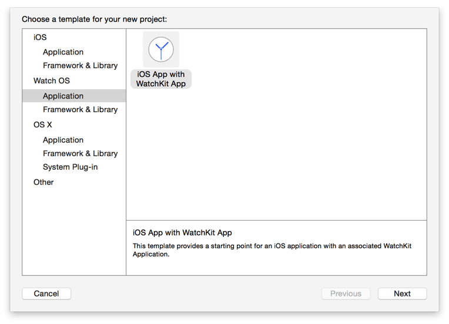
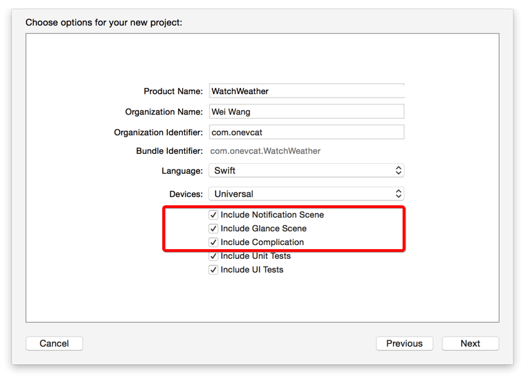
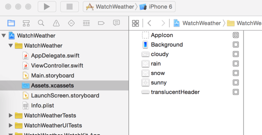
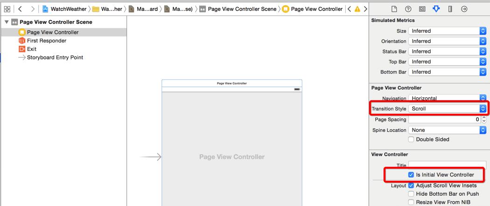
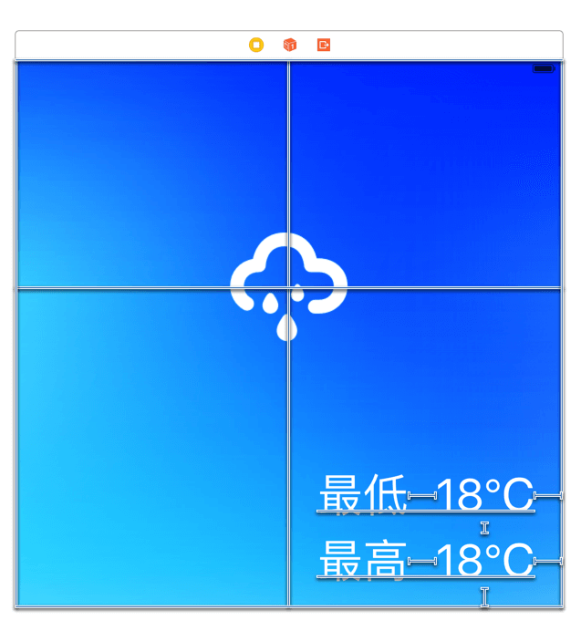
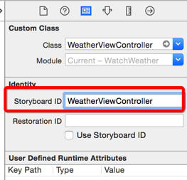
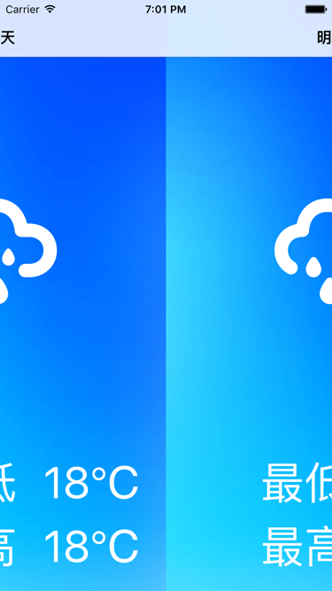
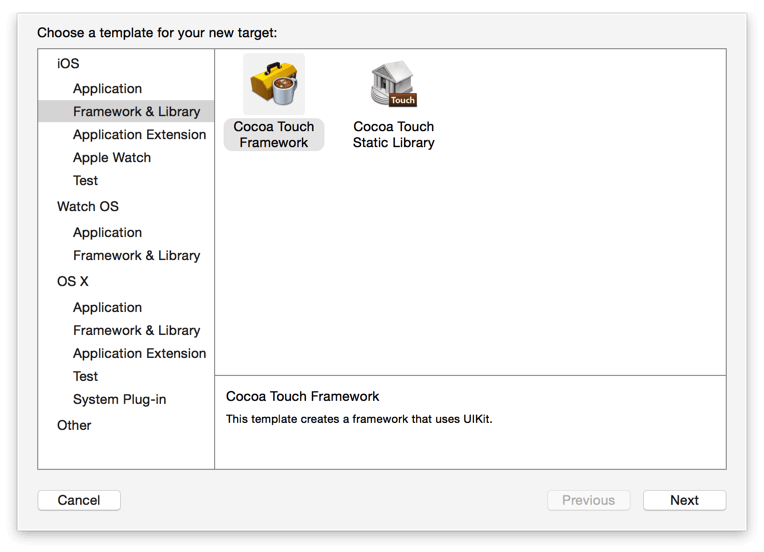

## 开发一个简单的 watchOS2 app-1

## 构建iphone App

参考：

[WWDC15 Session笔记 - 30 分钟开发一个简单的 watchOS 2 app](http://onevcat.com/2015/08/watchos2/)

Apple Watch 和 watchOS 第一代产品只允许用户在 iPhone 设备上进行计算，然后将结果传输到手表上进行显示。在这个框架下，手表充当的功能在很大程度上只是手机的另一块小一些的显示器。

而在 watchOS 2 中，Apple 开放了在手表端直接进行计算的能力，一些之前无法完成的 app 现在也可以进行构建了。本文将通过一个很简单的天气 app 的例子，讲解一下 watchOS 2 中新引入的一些特性的使用方法。

### 项目简介

构建一个最简单的天气 app。一步步带你从零开始构建一个相对完整的 iOS + watch app。这个 app 的 iOS 端很简单，从数据源取到数据，然后解析成天气的 model 后，通过一个 PageViewController 显示出来。为了让 demo 更有说服力，我们将展示当前日期以及前后两天的天气情况，包括天气状况和气温。在手表端，我们希望构建一个类似的 app，可以展示这几天的天气情况。另外我们当然也介绍如何利用 watchOS 2 的一些新特性，比如 complications 和 Time Travel 等等。

虽然本文的重点是 watchOS，但是为了完整性，我们还是从开头开始来构建这个 app 吧。因为不管是 watchOS 1 还是 2，一个手表 app 都是无法脱离手机 app 单独存在和申请的。所以我们首先来做的是一个像模像样的 iOS app 吧。

### 新建项目

使用 Xcode 7 新建一个工程，这里我们直接选择 iOS App with WatchKit App，这样 Xcode 将直接帮助我们建立一个带有 watchOS app 的 iOS 应用。



在接下来的画面中，我们选中 Include Complication 选项，因为我们希望制作一个包含有 Complication 的 watch app。



### UI

添加UI资源:



接下来，使用 PageViewController 来作为 app 的导航，首先，在 Main.StoryBoard 中删掉原来的 ViewController，并新加一个 Page View Controller，然后在它的 Attributes Inspector 中将 Transition Style 改为 Scroll，并勾选上 Is Initial View Controller。这将使这个 view controller 成为整个 app 的入口。



接下来，我们需要将这个 Page View Controller 和代码关联起来。创建MainViewController.swift，继承UIPageViewController。在 StoryBoard 文件中将刚才的 Page View Controller 的 class 改为MainViewController。

另外我们还需要一个实际展示天气的 View Controller。创建一个继承自 UIViewController 的 WeatherViewController，然后将 WeatherViewController.swift 的内容替换为：

```
import UIKit

class WeatherViewController: UIViewController {

	//定义了一个 Day 的枚举，它将用来标记这个 WeatherViewController 所代表的日期
    enum Day: Int {
        case DayBeforeYesterday = -2
        case Yesterday
        case Today
        case Tomorrow
        case DayAfterTomorrow
    }

    var day: Day?
}
```

接下来，我们在 StoryBoard 中添加一个 ViewController，并将它的 class 改为 WeatherViewController。并添加UI 和约束，并关联上代码，最后结果如下图所示：



然后我们可以考虑先把 Page View Controller 的框架实现出来。在 MainViewController.swift 中，我们首先在 MainViewController 类中加入以下方法：

```
func weatherViewControllerForDay(day: WeatherViewController.Day) -> UIViewController {

    let vc = storyboard?.instantiateViewControllerWithIdentifier("WeatherViewController") as! WeatherViewController
    let nav = UINavigationController(rootViewController: vc)
    vc.day = day

    return nav
}
```
这里需要在StoryBoard 中设置id，如下



接下来我们来实现 UIPageViewControllerDataSource。在 MainViewController.swift 的 viewDidLoad 里加入：

```
dataSource = self  
let vc = weatherViewControllerForDay(.Today)  
setViewControllers([vc], direction: .Forward, animated: true, completion: nil)  
```

对于 UIPageViewControllerDataSource 的实现，我们在同一文件中加入一个 MainViewController 的 extension 来搞定，这两个方法分别根据输入的 View Controller 对象来确定前一个和后一个 View Controller，如果返回 nil 则说明没有之前/后的页面了：

```
extension MainViewController: UIPageViewControllerDataSource {  
    func pageViewController(pageViewController: UIPageViewController, viewControllerBeforeViewController viewController: UIViewController) -> UIViewController? {
        guard let nav = viewController as? UINavigationController,
                  viewController = nav.viewControllers.first as? WeatherViewController,
                  day = viewController.day else {
            return nil
        }

        if day == .DayBeforeYesterday {
            return nil
        }

        guard let earlierDay = WeatherViewController.Day(rawValue: day.rawValue - 1) else {
            return nil
        }

        return self.weatherViewControllerForDay(earlierDay)
    }

    func pageViewController(pageViewController: UIPageViewController, viewControllerAfterViewController viewController: UIViewController) -> UIViewController? {
        guard let nav = viewController as? UINavigationController,
            viewController = nav.viewControllers.first as? WeatherViewController,
            day = viewController.day else {
                return nil
        }

        if day == .DayAfterTomorrow {
            return nil
        }

        guard let laterDay = WeatherViewController.Day(rawValue: day.rawValue + 1) else {
            return nil
        }

        return self.weatherViewControllerForDay(laterDay)
    }
}
```

另外，我们可能还想要先将 title 显示出来，以确定现在的架构是否正确工作。在 WeatherViewController.swift 的 Day 枚举里添加如下属性：

```
var title: String {  
            let result: String
            switch self {
            case .DayBeforeYesterday: result = "前天"
            case .Yesterday: result = "昨天"
            case .Today: result = "今天"
            case .Tomorrow: result = "明天"
            case .DayAfterTomorrow: result = "后天"
            }
            return result
        }
```

然后将 day 属性改为：

```
var day: Day? {  
    didSet {
        title = day?.title
    }
}
```

运行 app，现在我们应该可以在五个页面之间进行切换了。



### 重构和 Model

很难有人一次性就把代码写得完美无瑕，这也是重构的意义。重构从来不是一个“等待项目完成后再开始”的活动，而是应该随着项目的展开和进行，一旦发现有可能存在问题的地方，就尽快进行改进。

比如在上面我们将 Day 放在了 WeatherViewController 中，这显然不是一个很好地选择。这个枚举更接近于 Model 层的东西而非控制层，我们应该将它迁移到另外的地方。同样现在还需要实现的还有天气的 Model，即表征天气状况和高低温度的对象。我们将这些内容提取出来，放到一个 framework 中去，以便使用的维护。



我们首先对现有的 Day 进行迁移。创建一个新的 Cocoa Touch Framework target，命名为 WatchWeatherKit。在这个 target 中新建 Day.swift 文件，其中内容为：

```
public enum Day: Int {  
    case DayBeforeYesterday = -2
    case Yesterday
    case Today
    case Tomorrow
    case DayAfterTomorrow

    public var title: String {
        let result: String
        switch self {
        case .DayBeforeYesterday: result = "前天"
        case .Yesterday: result = "昨天"
        case .Today: result = "今天"
        case .Tomorrow: result = "明天"
        case .DayAfterTomorrow: result = "后天"
        }
        return result
    }
}
```

这就是原来存在于 WeatherViewController 中的代码，只不过将必要的内容申明为了 public，这样我们才能在别的 target 中使用它们。我们现在可以将原来的 Day 整个删除掉了，接下来，我们在 WeatherViewController.swift 和 ViewController.swift 最上面加入 import WatchWeatherKit，并将 WeatherViewController.Day 改为 Day。现在 Day 枚举就被隔离出 View Controller 了。

然后实现天气的 Model。在 WatchWeatherKit 里新建 Weather.swift，并书写如下代码：

```
import Foundation

public struct Weather {  
    public enum State: Int {
        case Sunny, Cloudy, Rain, Snow
    }

    public let state: State
    public let highTemperature: Int
    public let lowTemperature: Int
    public let day: Day

    public init?(json: [String: AnyObject]) {

        guard let stateNumber = json["state"] as? Int,
                  state = State(rawValue: stateNumber),
                  highTemperature = json["high_temp"] as? Int,
                  lowTemperature = json["low_temp"] as? Int,
                  dayNumber = json["day"] as? Int,
                  day = Day(rawValue: dayNumber) else {
            return nil
        }


        self.state = state
        self.highTemperature = highTemperature
        self.lowTemperature = lowTemperature
        self.day = day
    }
}
```
Model 包含了天气的状态信息和最高最低温度，我们稍后会用一个 JSON 字符串中拿到字典，然后初始化它。如果字典中信息不全的话将直接返回 nil 表示天气对象创建失败。

#### 获取天气信息

接下来的任务是获取天气的 JSON，作为一个 demo 我们完全可以用一个本地文件替代网络请求部分。不过因为之后在介绍 watch app 时会用到使用手表进行网络请求，所以这里我们还是从网络来获取天气信息。为了简单，假设我们从服务器收到的 JSON 是这个样子的：

```
{"weathers": [
    {"day": -2, "state": 0, "low_temp": 18, "high_temp": 25},
    {"day": -1, "state": 2, "low_temp": 9, "high_temp": 14},
    {"day": 0, "state": 1, "low_temp": 12, "high_temp": 16},
    {"day": 1, "state": 3, "low_temp": 2, "high_temp": 6},
    {"day": 2, "state": 0, "low_temp": 19, "high_temp": 28}
    ]}
```

其中 day 0 表示今天，state 是天气状况的代码。

我们已经有 Weather 这个 Model 类型了，现在我们需要一个 API Client 来获取这个信息。在 WeatherWatchKit target 中新建一个文件 WeatherClient.swift，并填写以下代码：

```
import Foundation

public let WatchWeatherKitErrorDomain = "com.onevcat.WatchWeatherKit.error"  
public struct WatchWeatherKitError {  
    public static let CorruptedJSON = 1000
}

public struct WeatherClient {

    public static let sharedClient = WeatherClient()
    let session = NSURLSession.sharedSession()

    public func requestWeathers(handler: ((weather: [Weather?]?, error: NSError?) -> Void)?) {

        guard let url = NSURL(string: "https://raw.githubusercontent.com/onevcat/WatchWeather/master/Data/data.json") else {
            handler?(weather: nil, error: NSError(domain: NSURLErrorDomain, code: NSURLErrorBadURL, userInfo: nil))
            return
        }

        let task = session.dataTaskWithURL(url) { (data, response, error) -> Void in
            if error != nil {
                handler?(weather: nil, error: error)
            } else {
                do {
                    let object = try NSJSONSerialization.JSONObjectWithData(data!, options: .AllowFragments)
                    if let dictionary = object as? [String: AnyObject] {
                        handler?(weather: Weather.parseWeatherResult(dictionary), error: nil)
                    }
                } catch _ {
                    handler?(weather: nil,
                               error: NSError(domain: WatchWeatherKitErrorDomain,
                                                code: WatchWeatherKitError.CorruptedJSON,
                                            userInfo: nil))
                }
            }
        }

        task!.resume()
    }
}
```

其实我们的 client 现在有点过度封装和耦合，不过作为 demo 来说的话还不错。它现在只有一个方法，就是从网络源请求一个 JSON 然后进行解析。解析的代码 parseWeatherResult 我们放在了 Weather 中，以一个 extension 的形式存在：

```
// MARK: - Parsing weather request
extension Weather {  
    static func parseWeatherResult(dictionary: [String: AnyObject]) -> [Weather?]? {
        if let weathers = dictionary["weathers"] as? [[String: AnyObject]] {
            return weathers.map{ Weather(json: $0) }
        } else {
            return nil
        }
    }
}
```

我们在 MainViewController 中使用这个方法即可获取到天气信息，就可以构建我们的 UI 了。在 MainViewController.swift 中，加入一个属性来存储天气数据：

	var data = [Day: Weather]()

然后更改 viewDidLoad 的代码：

```
override func viewDidLoad() {
        super.viewDidLoad()

        //将 viewController 自己设置为 dataSource。
        dataSource = self
        
        //使用一个临时的 UIViewController 来作为 PageViewController 在网络请求时的初始视图控制
        let vc = UIViewController()
        vc.view.backgroundColor = UIColor.whiteColor()
        setViewControllers([vc], direction: .Forward, animated: true, completion: nil)
        
        self.loadData()
    }
```

一开始使用了一个临时的 UIViewController 来作为 PageViewController 在网络请求时的初始视图控制 (虽然在我们的例子中这个初始视图就是一块白屏幕)。接下来进行网络请求，并把得到的数据存储在 data 变量中以待使用。之后我们需要把这些数据传递给不同日期的 ViewController，在 weatherViewControllerForDay 方法中，换为对 weather 做设定，而非 day：

```
func weatherViewControllerForDay(day: Day) -> UIViewController {

    let vc = self.storyboard?.instantiateViewControllerWithIdentifier("WeatherViewController") as! WeatherViewController
    let nav = UINavigationController(rootViewController: vc)
    vc.weather = data[day]

    return nav
}
```

同时我们还需要修改一下 WeatherViewController，将原来的：

```
var day: Day? {  
    didSet {
        title = day?.title
    }
}
```
改为

```
var weather: Weather? {  
    didSet {
        title = weather?.day.title
    }
}
```

另外还需要在 UIPageViewControllerDataSource 的两个方法中，把对应的 viewController.day 换为 viewController.weather?.day。最后我们要做的是在 WeatherViewController 的 viewDidLoad 中根据 model 更新 UI：

```
override func viewDidLoad() {
        super.viewDidLoad()
        
        //一个可能的改进是新建一个 WeatherViewModel 来将对 View 的内容和 Model 的映射关系代码从 ViewController 里分理出去
        lowTemprature.text = "\(weather!.lowTemperature)℃"
        highTemprature.text = "\(weather!.highTemperature)℃"
        
        let imageName: String
        switch weather!.state {
        case .Sunny: imageName = "sunny"
        case .Cloudy: imageName = "cloudy"
        case .Rain: imageName = "rain"
        case .Snow: imageName = "snow"
        }
        
        weatherImage.image = UIImage(named: imageName)

    }
```

到此我们的 iOS 端的代码就全部完成了