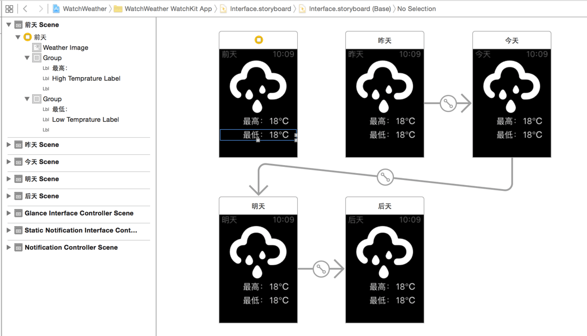
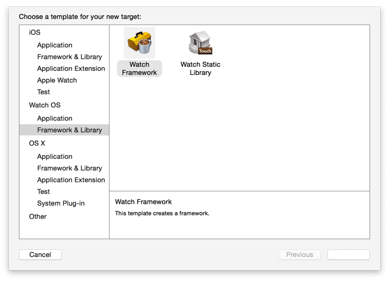
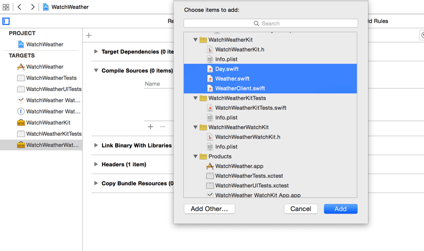
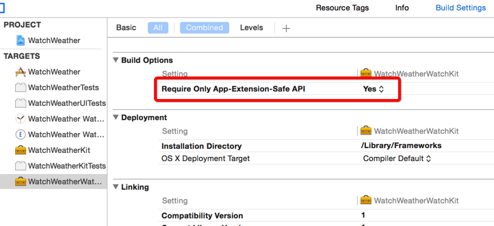
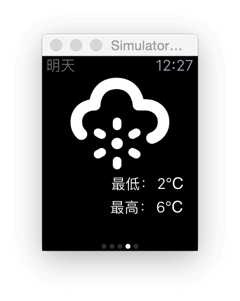
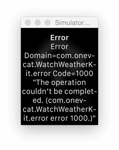

## 开发一个简单的 watchOS2 app-2

## 构建Watch App

开始设计和制作 watch app。

### UI 构建

首先把需要的图片添加到 watch app target 的 Assets.xcassets 中，这样在之后用户安装 app 时这些图片将被存放在手表中，我们可以直接快速地从手表本地读取。

UI 的设计非常简单，在 Watch app 的 Interface.storyboard 中，我们先将代表天气状态的图片和温度标签拖拽到 InterfaceController 中，并将它们连接到 InterfaceController.swift 中的 IBOutlet 去。

```
@IBOutlet var weatherImage: WKInterfaceImage!
@IBOutlet var highTempratureLabel: WKInterfaceLabel!
@IBOutlet var lowTempratureLabel: WKInterfaceLabel!
```
接下来，我们将它复制四次，并用 next page 的 segue 串联起来，并设置它们的 title。这样，在最后的 watch app 里我们就会有五个可以左右 scorll 滑动的页面，分别表示从前天到后天的五个日子。



为了标记和区分这五个 InterfaceController 实例。***因为使用 next page 级联的 WKInterfaceController 会被依次创建，***所以我们可以在 awakeWithContext 方法中用一个静态变量计数。在这里，我们想要将序号为 2 的 InterfaceController (也就是代表 “今天” 的那个) 设为当前 page。在 InterfaceController.swift 里添加一个静态变量：

	static var index = 0  

然后在 awakeWithContext 方法中加入：

```
InterfaceController.index = InterfaceController.index + 1  
if (InterfaceController.index == 2) {  
    becomeCurrentPage()
}
```

### WatchKit Framework

和 iOS app 类似，我们希望能够使用框架来组织代码。watch app 中的天气 model 和网络请求部分的内容其实和 iOS app 中的是完全一样的，我们没有理由重复开发。

在一个 watch app 中，其实 app 本身只负责图形显示，实际的代码都是在 extension 中的。

在 watchOS 2 之前，因为 extension 是在手机端，和 iOS app 处于同样的物理设备中，所以我们可以简单地将为 iOS app 中创建的框架使用在 watch extension target 中。但是在 watchOS 2 中发生了变化，因为 extension 现在直接将运行在手表上，我们无法与 iOS app 共享同一个框架了。取而代之，我们需要为手表 app 创建新的属于自己的 framewok，然后将合适的文件添加到这个 framework 中去。

为项目新建一个 target，类型选择为 Watch OS 的 Watch Framework。



接下来，我们把之前的 Day.swift，Weather.swift 和 WeatherClient.swift 三个文件添加到这个新的 target (在这里我们叫它 WatchWeatherWatchKit) 里去。我们将在新的这个 watch framework 中重用这三个文件。这样做相较于直接把这三个文件放到 watch extension target 中来说，会更易于管理组织和模块分割，也是 Apple 所推荐的使用方式。



下面这步可能不用：


接下来我们需要手动在 watch extension 里将这个新的 framework 链接进来。在 WatchWeather WatchKit Extension target 的 General 页面中，将 WatchWeatherWatchKit 添加到 Embedded Binaries 中。Xcode 将会自动把它加到 Link Binary With Libraries 里去。

这时候如果你尝试编译 watch app，可能会得到一个警告："Linking against dylib not safe for use in application extensions"。这是因为不论是 iOS app 的 extension 还是 watchOS 的 extension，所能使用的 API 都只是完整 iOS SDK 的子集。编译器无法确定我们所动态链接的框架是否含有一些 extension 无法调用的 API。要解决这个警告，我们可以通过在 WatchWeatherWatchKit 的 Build Setting 中将 "Require Only App-Extension-Safe API" 设置为 YES 来将 target 里可用的 API 限制在 extension 中。



是时候来实现我们的 app 了。首先一刻都不能再忍受的是 InterfaceController.swift 中的 index。我们既然有了 WatchWeatherWatchKit，就可以利用已有的模型将这里写得更清楚。在 InterfaceController.swift 中，首先在文件上面 import WatchWeatherWatchKit，然后修改 index 的定义，并添加一个字典来临时保存这些 Interface Controller，以便之后使用：

```
static var index = Day.DayBeforeYesterday.rawValue  
static var controllers = [Day: InterfaceController]()  
```

将刚才我们的在 awakeWithContext 中添加的内容删掉，改为：

```
override func awakeWithContext(context: AnyObject?) {  
    super.awakeWithContext(context)

    // Configure interface objects here.
    guard let day = Day(rawValue: InterfaceController.index) else {
        return
    }

    InterfaceController.controllers[day] = self
    InterfaceController.index = InterfaceController.index + 1

    if day == .Today {
        becomeCurrentPage()
    }
}
```

接下来就是获取天气信息了。和 iOS app 中一样，我们可以直接使用 WeatherClient 来获取。在 InterfaceController.swift 中加入以下代码：

```
var weather: Weather? {  
    didSet {
        if let w = weather {
            updateWeather(w)
        }
    }
}

func request() {  
    WeatherClient.sharedClient.requestWeathers({ [weak self] (weathers, error) -> Void in
        if let weathers = weathers {
            for weather in weathers where weather != nil {
                guard let controller = InterfaceController.controllers[weather!.day] else {
                    continue
                }
                controller.weather = weather
            }
        } else {
            // 2
            let action = WKAlertAction(title: "Retry", style: .Default, handler: { () -> Void in
                self?.request()
            })
            let errorMessage = (error != nil) ? error!.description : "Unknown Error"
            self?.presentAlertControllerWithTitle("Error", message: errorMessage, preferredStyle: .Alert, actions: [action])
        }
    })
}
```

如果我们获取到了天气，就设置 weather 属性并调用 updateWeather 方法依次对相应的 InterfaceController 的 UI 进行设置。如果出现了错误，我们这里简单地用一个 watchOS 2 中新加的 alert view 来进行提示并让用户重试。在这个方法的下面加上更新 UI 的方法 updateWeather：

```
func updateWeather(weather: Weather) {  
    lowTempratureLabel.setText("\(weather.lowTemperature)℃")
    highTempratureLabel.setText("\(weather.highTemperature)℃")

    let imageName: String
    switch weather.state {
    case .Sunny: imageName = "sunny"
    case .Cloudy: imageName = "cloudy"
    case .Rain: imageName = "rain"
    case .Snow: imageName = "snow"
    }

    weatherImage.setImageNamed(imageName)
}
```

我们只需要网络请求进行一次就可以了，所以在这里我们用一个 once_token 来限定一开始的 request 只执行一次。在 InterfaceController.swift 中加上一个类变量：

	static var token: dispatch_once_t = 0  

然后在 awakeWithContext 的最后用 dispatch_once 来开始请求：

```
dispatch_once(&InterfaceController.token) { () -> Void in  
    self.request()
}
```

最后，在 willActivate 中也需要刷新 UI：

```
override func willActivate() {  
    super.willActivate()
    if let w = weather {
        updateWeather(w)
    }
}
```

选定手表 scheme，运行程序，除了图标的尺寸不太对以及网络请求时还显示默认的天气状况和温度以外，其他的看起来还不赖：



值得一提的是，如果你多测试几次，比如关闭整个 app (或者模拟器)，然后再运行的话，可能会有一定几率遇到下面这样的错误：



这个 1000 错误就是我们定义在 WeatherClient.swift 中的 CorruptedJSON 错误。调试一下，你就会发现在请求返回时得到的数据存在问题，会得到一个内容被完整复制了一遍的返回 (比如正确的数据 {a:1}，但是我们得到的是 {a:1} {a:1})。虽然我不是太明白为什么会出现这样的状况，但这应该是 NSURLSession 在 watchOS SDK 上的一个缓存上的 bug。

现在的话，我们可以通过设置不带缓存的 NSURLSessionConfiguration 来绕开这个问题。将 WeatherClient 中的 session 属性改为以下即可：

	let session = NSURLSession(configuration: NSURLSessionConfiguration.ephemeralSessionConfiguration())  

我们的 watch app 本体就完成了。

Notification 和 Glance 两个特性相对简单，基本只是界面的制作，你可以分别在[这里](https://developer.apple.com/library/ios/documentation/General/Conceptual/WatchKitProgrammingGuide/ImplementingaGlance.html#//apple_ref/doc/uid/TP40014969-CH5-SW1)和[这里](https://developer.apple.com/library/ios/documentation/General/Conceptual/WatchKitProgrammingGuide/BasicSupport.html#//apple_ref/doc/uid/TP40014969-CH18-SW1)找到开发两者所需要的一切知识。