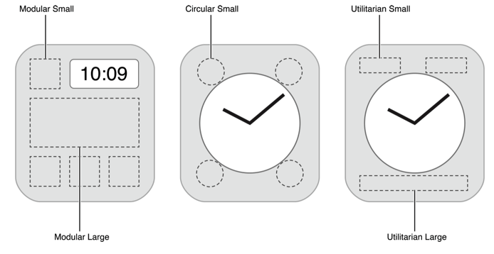
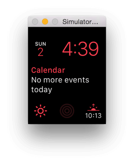
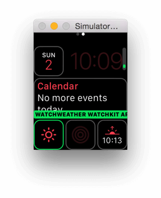
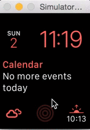

## 开发一个简单的 watchOS2 app-3

## Complications

Complications 是 watchOS 2 新加入的特性，它是表盘上除了时间以外的一些功能性的小部件。比如我们的天气 app 里，将今天的天气状况显示在表盘上就是一个非常理想的应用场景，这样用户就不需要打开你的 app 就能看到今天的天气状况了，我们在这一小节中将为刚才的天气 app 实现一个 complication。

Complications 可以是不同的形状，如图所示：



根据用户表盘选择的不同，表盘上对应的可用的 complications 形状也各不相同。如果你想要你的 complication 在所有表盘上都能使用的话，你需要实现所有的形状。

掌管 complications 或者说是表盘相关的框架并不是我们一直使用的 WatchKit，而是一个 watchOS 2 中全新框架，ClockKit。ClockKit 会提供一些模板给我们，并在一定时间点向我们请求数据。我们依照模板使用我们的数据来实现 complication，最后 ClockKit 负责帮助我们将其渲染在表盘上。

在 ClockKit 请求数据时，它会唤醒我们的 watch extension。我们需要在 extension 中实现数据源，并以一段时间线的方式把数据提供给 ClockKit。这样做有两个好处：

- 首先 ClockKit 可以一次性获取到很多数据，这样它就能在合适的时候更新 complication 的显示，而不必再次唤醒 extension 来请求数据。
- 其次，因为有一条时间线的数据，我们就可以使用 Time Travel 来查看 complication 已经过去的和即将到来的状况，这在某些场合下会十分方便。

理论已经说了很多了，来实际操作一下吧。

首先，因为我们在新建项目的时候已经选择了包含 complications，所以我们并不需要再进行额外的配置就可以开始了。如果你不小心没有选中这个选项，或者是想在已有项目中进行添加的话，你就需要手动配置，在 extension 的 target 里的 Complications Configuration 中指定数据源的 class 和支持的形状。在运行时，系统会使用在这个设置中指定的类型名字去初始化一个的实例，然后调用这个实例中实现的数据源方法。我们要做的就是在被询问这些方法时，尽快地提供需要的数据。

第一步是实现数据源，这在在我们的项目中已经配置好了，就是 ComplicationController.swift。这是一个实现了 CLKComplicationDataSource 的类型，打开文件可以看到所有的方法都已经有默认空实现了，我们现在要做的就是把这些空填上。其中最关键的是 getCurrentTimelineEntryForComplication:withHandler:，我们需要通过这个方法来提供当前表盘所要显示的 complication。罗马不是一天建成的，项目也不是。我们先提供一个 dummy 的数据来让流程运作起来。在 ComplicationController.swift 中，将这个方法的内容换成：

```
/**
    最关键的方法，通过这个方法来提供当前表盘所要显示的 complication。
    系统会提供给我们所需要的 complication 的类型，我们要做的是使用合适的系统所提供的模板 (这里是 CLKComplicationTemplateModularSmallSimpleImage) 
    以及我们自己的数据，来构建一个 CLKComplicationTimelineEntry 对象，然后再 handler 中返回给系统。
    */
    func getCurrentTimelineEntryForComplication(complication: CLKComplication, withHandler handler: ((CLKComplicationTimelineEntry?) -> Void)) {
        // Call the handler with the current timeline entry
        var entry: CLKComplicationTimelineEntry?
        let now = NSDate()
        
        //我们这里选择了一个小的简单图片的模板。另外因为篇幅有限，这里只实现了 .ModularSmall。在实际的项目中，你应该支持尽量多的 complication 类型，这样可以保证你的用户在不同的表盘上都能使用。
        // Create the template and timeline entry.
        if complication.family == .ModularSmall {
            let imageTemplate = CLKComplicationTemplateModularSmallSimpleImage()
            imageTemplate.imageProvider = CLKImageProvider(onePieceImage: UIImage(named: "sunny")!)
            
            // Create the entry.
            entry = CLKComplicationTimelineEntry(date: now, complicationTemplate: imageTemplate)
        } else {
            // ...configure entries for other complication families.
        }
        
        // Pass the timeline entry back to ClockKit.
        handler(entry)
    }
```

在这个方法中，系统会提供给我们所需要的 complication 的类型，我们要做的是使用合适的系统所提供的模板 (这里是 CLKComplicationTemplateModularSmallSimpleImage) 以及我们自己的数据，来构建一个 CLKComplicationTimelineEntry 对象，然后再 handler 中返回给系统。结合天气 app 的特点，我们这里选择了一个小的简单图片的模板。另外因为篇幅有限，这里只实现了 .ModularSmall。在实际的项目中，你应该支持尽量多的 complication 类型，这样可以保证你的用户在不同的表盘上都能使用。

在提供具体的数据时，我们使用 template 的 imageProvider 或者 textProvider。在我们现在使用的这个模板中，只有一个简单的 imageProvider，我们从 extension 的 Assets Category 中获取并设置合适的图像就可以了 (对于 .ModularSmall 来说，需要图像的尺寸为 52px 和 58px 的 @2x。关于其他模板的图像尺寸要求，可以参考[文档](https://developer.apple.com/library/prerelease/watchos/documentation/ClockKit/Reference/ClockKit_framework/index.html#//apple_ref/doc/uid/TP40016082))。

运行程序，选取一个带有 ModularSmall complication 的表盘 (如果是在模拟器的话，可以使用 Shift+Cmd+2 然后点击表盘来打开表盘选择界面)，然后在 complication 中选择 WatchWeather，可以看到以下的结果：



看起来不错，我们的小太阳已经在界面上熠熠生辉了，接下来就是要实现把实际的数据替换进来。

对于 complication 来说，我们需要以尽可能快的速度去调用 handler 来向系统提供数据。我们并没有那么多时间去从网络上获取数据，所以需要使用之前在 watch app 或者是 iOS app 中获取到的数据来组织 complication。

为了在 complication 中能直接获取数据，我们需要在用 Client 获取到数据后把它存在本地。这里我们用 UserDefaults 就已经足够了。在 Weather.swift 中加入以下 extension：

```
public let kWeatherResultsKey = "com.onevcat.watchweather.results"
public let kWeatherRequestDateKey = "com.onevcat.watchweather.request_date"

public extension Weather {
    public static func storeWeathersResult(dictionary: [String: AnyObject]) {
        let userDefault = NSUserDefaults.standardUserDefaults()
        userDefault.setObject(dictionary, forKey: kWeatherResultsKey)
        userDefault.setObject(NSDate(), forKey: kWeatherRequestDateKey)
        
        userDefault.synchronize()
    }
    
    public static func storedWeathers() -> (requestDate: NSDate?, weathers: [Weather?]?) {
        let userDefault = NSUserDefaults.standardUserDefaults()
        let date = userDefault.objectForKey(kWeatherRequestDateKey) as? NSDate
        
        let weathers: [Weather?]?
        if let dic = userDefault.objectForKey(kWeatherResultsKey) as? [String: AnyObject] {
            weathers = parseWeatherResult(dic)
        } else {
            weathers = nil
        }
        
        return (date, weathers)
    }
}
```

这里我们需要知道获取到这组数据时的时间，我们以当前时间作为获取时间进行存储。一个更加合适的做法应该是在请求的返回中包含每个天气状况所对应的时间信息。但是因为我们并没有真正的服务器，也并非实际的请求，所以这里就先简单粗暴地用本地时间了。接下来，在每次请求成功后，我们调用 storeWeathersResult 将结果存储起来。在 WeatherClient.swift 中，把

```
dispatch_async(dispatch_get_main_queue(), { () -> Void in  
    handler?(weathers: Weather.parseWeatherResult(dictionary), error: nil)
})
```
这段代码改为：

```
dispatch_async(dispatch_get_main_queue(), { () -> Void in  
    let weathers = Weather.parseWeatherResult(dictionary)
    if weathers != nil {
        Weather.storeWeathersResult(dictionary)
    }
    handler?(weathers: weathers, error: nil)
})
```

接下来我们还需要另外一项准备工作。Complication 的时间线是以一组 CLKComplicationTimelineEntry 来表示的，一个 entry 中包含了 template 和对应的 NSDate。watchOS 将在当前时间超过这个 NSDate 时表示。所以如果我们需要显示当天的天气情况的话，就需要将对应的日期设定为当日的 0 点 0 分。对于其他几个日期的天气来说，这个状况也是一样的。

我们需要添加一个方法来通过 Weather 的 day 属性和请求的当日日期来返回一个对应 entry 中需要的日期。为了运算简便，我们这里引入一个第三方框架，SwiftDate。将这个项目导入我们 app，然后在 Weather.swift 中添加：

```

public extension Weather {
    
    //将对应的日期设定为当日的 0 点 0 分
    public func dateByDayWithRequestDate(requestDate: NSDate) -> NSDate {
        let dayOffset = day.rawValue
        let date = requestDate.set(componentsDict: ["hour":0, "minute":0, "second":0])!
        return date + dayOffset.day
    }
}
```

接下来我们就可以更新 ComplicationController.swift 的内容了。首先我们需要实现 getTimelineStartDateForComplication:withHandler: 和 getTimelineEndDateForComplication:withHandler: 来告诉系统我们所能提供 complication 的日期区间：

```
/**
     告诉系统我们所能提供 complication 的日期区间：
     
     Complication 的时间线是以一组 CLKComplicationTimelineEntry 来表示的，一个 entry 中包含了 template 和对应的 NSDate。
     watchOS 将在当前时间超过这个 NSDate 时表示。所以如果我们需要显示当天的天气情况的话，就需要将对应的日期设定为当日的 0 点 0 分。
     
     - parameter complication: <#complication description#>
     - parameter handler:      <#handler description#>
     */
    func getTimelineStartDateForComplication(complication: CLKComplication, withHandler handler: (NSDate?) -> Void) {
        var date: NSDate? = nil
        let (requestDate, weathers) = Weather.storedWeathers()
        
        if let weathers = weathers,
            requestDate = requestDate {
                for w in weathers where w != nil {
                    if w!.day == .DayBeforeYesterday {
                        date = w!.dateByDayWithRequestDate(requestDate)
                        break
                    }
                }
        }
        
        handler(date)
    }
    
    /**
     告诉系统我们所能提供 complication 的日期区间：
     
     最早的时间是前天的 00:00，这是毫无疑问的。但是最晚的可显示时间并不是后天的 00:00，而是 23:59:59，这里一定需要注意。
     */
    func getTimelineEndDateForComplication(complication: CLKComplication, withHandler handler: (NSDate?) -> Void) {
        var date: NSDate? = nil
        let (requestDate, weathers) = Weather.storedWeathers()
        
        if let weathers = weathers,
            requestDate = requestDate {
                for w in weathers where w != nil {
                    if w!.day == .DayAfterTomorrow {
                        date = w!.dateByDayWithRequestDate(requestDate) + 1.day - 1.second
                        break
                    }
                }
        }
        
        handler(date)
    }
```

最早的时间是前天的 00:00，这是毫无疑问的。但是最晚的可显示时间并不是后天的 00:00，而是 23:59:59，这里一定需要注意。

另外，为了之后创建 template 能容易一些，我们添加一个由 Weather.State 创建 template 的方法：

```
private func templateForComplication(complication: CLKComplication, weatherState: Weather.State) -> CLKComplicationTemplate? {
        let imageTemplate: CLKComplicationTemplate?
        
        //我们这里选择了一个小的简单图片的模板。另外因为篇幅有限，这里只实现了 .ModularSmall。在实际的项目中，你应该支持尽量多的 complication 类型，这样可以保证你的用户在不同的表盘上都能使用。
        if complication.family == .ModularSmall {
            imageTemplate = CLKComplicationTemplateModularSmallSimpleImage()
            
            let imageName: String
            switch weatherState {
            case .Sunny: imageName = "sunny"
            case .Cloudy: imageName = "cloudy"
            case .Rain: imageName = "rain"
            case .Snow: imageName = "snow"
            }
            
            (imageTemplate as! CLKComplicationTemplateModularSmallSimpleImage).imageProvider = CLKImageProvider(onePieceImage: UIImage(named: imageName)!)
        } else {
            imageTemplate = nil
        }
        
        return imageTemplate
    }

```

接下来就是实现核心的三个提供时间轴的方法了，虽然很长，但是做的事情却差不多：

```
func getCurrentTimelineEntryForComplication(complication: CLKComplication, withHandler handler: ((CLKComplicationTimelineEntry?) -> Void)) {
        // Call the handler with the current timeline entry
        var entry : CLKComplicationTimelineEntry?
        
        // Create the template and timeline entry.
        let (requestDate, weathers) = Weather.storedWeathers()
        
        //getCurrentTimelineEntryForComplication 中我们找到今天的 Weather 对象，然后构建合适的 entry。
        if let weathers = weathers,
            requestDate = requestDate {
                for w in weathers where w != nil {
                    
                    let weatherDate = w!.dateByDayWithRequestDate(requestDate)
                    if weatherDate == NSDate.today() {
                        
                        if let template = templateForComplication(complication, weatherState: w!.state) {
                            entry = CLKComplicationTimelineEntry(date: weatherDate, complicationTemplate: template)
                        }
                    }
                }
        }
        
        // Pass the timeline entry back to ClockKit.
        handler(entry)
    }
    
    func getTimelineEntriesForComplication(complication: CLKComplication, beforeDate date: NSDate, limit: Int, withHandler handler: (([CLKComplicationTimelineEntry]?) -> Void)) {
        // Call the handler with the timeline entries prior to the given date
        var entries = [CLKComplicationTimelineEntry]()
        let (requestDate, weathers) = Weather.storedWeathers()
        
        if let weathers = weathers,
            requestDate = requestDate {
                for w in weathers where w != nil {
                    let weatherDate = w!.dateByDayWithRequestDate(requestDate)
                    if weatherDate < date {
                        if let template = templateForComplication(complication, weatherState: w!.state) {
                            let entry = CLKComplicationTimelineEntry(date: weatherDate, complicationTemplate: template)
                            entries.append(entry)
                            
                            if entries.count == limit {
                                break
                            }
                        }
                    }
                }
        }
        
        handler(entries)
    }
    
    func getTimelineEntriesForComplication(complication: CLKComplication, afterDate date: NSDate, limit: Int, withHandler handler: (([CLKComplicationTimelineEntry]?) -> Void)) {
        // Call the handler with the timeline entries after to the given date
        var entries = [CLKComplicationTimelineEntry]()
        let (requestDate, weathers) = Weather.storedWeathers()
        
        if let weathers = weathers,
            requestDate = requestDate {
                for w in weathers where w != nil {
                    let weatherDate = w!.dateByDayWithRequestDate(requestDate)
                    if weatherDate > date {
                        if let template = templateForComplication(complication, weatherState: w!.state) {
                            let entry = CLKComplicationTimelineEntry(date: weatherDate, complicationTemplate: template)
                            entries.append(entry)
                            
                            if entries.count == limit {
                                break
                            }
                        }
                    }
                }
        }
        
        handler(entries)
    }
```

代码来说非常简单。getCurrentTimelineEntryForComplication 中我们找到今天的 Weather 对象，然后构建合适的 entry。而对于 beforeDate 和 afterDate 两个版本的方法，按照系统提供的 date 我们需要组织在这个 date 之前或者之后的所有 entry，并将它们放到一个数组中去调用回调。这两个方法中还为我们提供了一个 limit 参数，我们的结果数应该不超过这个数字。在实现这三个方法后，我们的时间线就算是构建完毕了。

另外，我们还可以通过实现 getPlaceholderTemplateForComplication:withHandler: 来提供一个在表盘定制界面是会用到的占位图像。

```
func getPlaceholderTemplateForComplication(complication: CLKComplication, withHandler handler: (CLKComplicationTemplate?) -> Void) {  
    // This method will be called once per supported complication, and the results will be cached
    handler(templateForComplication(complication, weatherState: .Sunny))
}
```

这样，在自定义表盘界面我们也可以在选择到我们的 complication 时看到表示我们的 complication 的样式了：



ComplicationController 中最后需要实现的是 getNextRequestedUpdateDateWithHandler。系统会在你的 watch app 被运行时更新时间线，另外要是你的 app 一直没有被运行的话，你可以通过这个方法提供给系统一个参考时间，用来建议系统应该在什么时候为你更新时间线。这个时间应该尽可能长，以节省电池的电量。在我们的天气的例子中，每天一次更新也许会是个不错的选择：

```
func getNextRequestedUpdateDateWithHandler(handler: (NSDate?) -> Void) {  
    // Call the handler with the date when you would next like to be given the opportunity to update your complication content
    handler(NSDate.tomorrow());
}
```

>你也许会注意到，因为我们这里要是不开启 watch app 的话，其实天气数据时不会更新的，这样我们设定刷新时间线似乎并没有什么意义 - 因为不开 watch app 的话数据并不会变化，而开了 watch app 的话时间线就会直接被刷新。这里我们考虑到了之后使用 Watch Connectivity 从手机端刷新 watch 数据的可能性，所以做了每天刷新一次的设置。我们在稍后会详细将这方面内容。

另外，我们还需要记得在 watch app 数据更新之后，强制 reload 一下 complication 的数据。在 ComplicationController.swift 中加入：

```
static func reloadComplications() {  
    let server = CLKComplicationServer.sharedInstance()
    for complication in server.activeComplications {
        server.reloadTimelineForComplication(complication)
    }
}
```

然后在 InterfaceController.swift 的 request 中，在请求成功返回后调用一下这个方法就可以了。

现在，我们的 watch app 已经支持 complication 了。同时，因为我们努力提供了之前和之后的数据，我们免费得到了 Time Travel 的支持。现在你不仅可以在表盘上看到今天的天气，通过旋转 Digital Crown 你还能了解到之前和之后的天气状况了：

