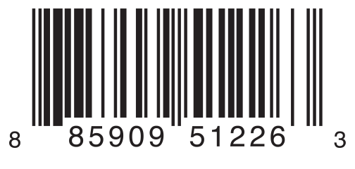

#枚举

枚举为一组相关的值定义了一个共同的类型，使你可以在你的代码中以类型安全的方式来使用这些值。

在 Swift 中，枚举类型是一等（first-class）类型。它们采用了很多在传统上只被类（class）所支持的特性，枚举也可以定义构造函数（initializers）来提供一个初始值；可以在原始实现的基础上扩展它们的功能；还可以遵守协议（protocols）来提供标准的功能。

##枚举语法

```
enum SomeEnumeration {
    // 枚举定义放在这里
}
```
下面是用枚举表示指南针四个方向的例子：

```
enum CompassPoint {
    case North
    case South
    case East
    case West
}
```

>与 C 和 Objective-C 不同，Swift 的枚举成员在被创建时不会被赋予一个默认的整型值。在上面的CompassPoint例子中，North，South，East和West不会被隐式地赋值为0，1，2和3。相反，这些枚举成员本身就是完备的值，这些值的类型是已经明确定义好的CompassPoint类型。


多个成员值可以出现在同一行上，用逗号隔开：

```
enum Planet {
    case Mercury, Venus, Earth, Mars, Jupiter, Saturn, Uranus, Neptune
}
```
每个枚举定义了一个全新的类型。像 Swift 中其他类型一样，它们的名字（例如CompassPoint和Planet）应该以一个大写字母开头。给枚举类型起一个单数名字而不是复数名字。

---
```
var directionToHead = CompassPoint.West
```

directionToHead的类型可以在它被CompassPoint的某个值初始化时推断出来。一旦directionToHead被声明为CompassPoint类型，你可以使用更简短的点语法将其设置为另一个CompassPoint的值：

```
directionToHead = .East
```

当directionToHead的类型已知时，再次为其赋值可以省略枚举类型名。

##使用 Switch 语句匹配枚举值

switch语句匹配单个枚举值：

```
directionToHead = .South
switch directionToHead {
    case .North:
        print("Lots of planets have a north")
    case .South:
        print("Watch out for penguins")
    case .East:
        print("Where the sun rises")
    case .West:
        print("Where the skies are blue")
}
// 输出 "Watch out for penguins”
```

正如在控制流（Control Flow）中介绍的那样，在判断一个枚举类型的值时，switch语句必须穷举所有情况。如果忽略任意一种情况，代码将无法通过编译。强制穷举确保了枚举成员不会被意外遗漏。当不需要匹配每个枚举成员的时候，你可以提供一个default分支来涵盖所有未明确处理的枚举成员。

```
let somePlanet = Planet.Earth
switch somePlanet {
case .Earth:
    print("Mostly harmless")
default:
    print("Not a safe place for humans")
}
// 输出 "Mostly harmless”
```
##关联值（Associated Values）

有时候能够把其他类型的关联值和成员值一起存储起来会很有用。这能让你连同成员值一起存储额外的自定义信息，并且你每次在代码中使用该枚举成员时，还可以修改这个关联值。

你可以定义 Swift 枚举来存储任意类型的关联值，如果需要的话，每个枚举成员的关联值类型可以各不相同。


例如，假设一个库存跟踪系统需要利用两种不同类型的条形码来跟踪商品。有些商品上标有使用0到9的数字的 UPC-A 格式的一维条形码。每一个条形码都有一个代表“数字系统”的数字，该数字后接五位代表“厂商代码”的数字，接下来是五位代表“产品代码”的数字。最后一个数字是“检查”位，用来验证代码是否被正确扫描：



其他商品上标有 QR 码格式的二维码，它可以使用任何 ISO 8859-1 字符，并且可以编码一个最多拥有 2,953 个字符的字符串：


在 Swift 中，使用如下方式定义表示两种商品条形码的枚举：

```
enum Barcode {
    case UPCA(Int, Int, Int, Int)
    case QRCode(String)
}
```

“定义一个名为Barcode的枚举类型，它的一个成员值是具有(Int，Int，Int，Int)类型关联值的UPCA，另一个成员值是具有String类型关联值的QRCode。”

这个定义不提供任何Int或String类型的关联值，它只是定义了，当Barcode常量和变量等于Barcode.UPCA或Barcode.QRCode时，可以存储的关联值的类型。

```
var productBarcode1 = Barcode.UPCA(8, 85909, 51226, 3)
var productBarcode2 = Barcode.QRCode("ABCDEFGHIJKLMNOP")
```
我们也可以对该变量任意赋值:	

```
var productBarcode1 = Barcode.QRCode("SKLGLKGHIJUNGKOP")
var productBarcode2 = Barcode.UPCA(0, 12568, 86234, 9)
```
Barcode类型的常量和变量可以存储一个.UPCA或者一个.QRCode（连同它们的关联值），但是在同一时间只能存储这两个值中的一个。

-
可以使用一个 switch 语句来检查不同的条形码类型。然而，这一次，关联值可以被提取出来作为 switch 语句的一部分。你可以在switch的 case 分支代码中提取每个关联值作为一个常量（用let前缀）或者作为一个变量（用var前缀）来使用。如果所有的关联值都被提取为常量或者都提取为变量，可以值在成员名前加一个let或者var。

```
switch productBarcode {
case .UPCA(let numberSystem, let manufacturer, let product, let check):
    print("UPC-A: \(numberSystem), \(manufacturer), \(product), \(check).")
case .QRCode(let productCode):
    print("QR code: \(productCode).")
}
// 输出 "QR code: ABCDEFGHIJKLMNOP."
```

```
switch productBarcode {
case let .UPCA(numberSystem, manufacturer, product, check):
    print("UPC-A: \(numberSystem), \(manufacturer), \(product), \(check).")
case let .QRCode(productCode):
    print("QR code: \(productCode).")
}
// 输出 "QR code: ABCDEFGHIJKLMNOP."
```

##原始值（Raw Values）

作为关联值的替代选择，枚举成员可以被默认值（称为原始值 ）预填充，这些原始值的类型必须相同。

这是一个使用 ASCII 码作为原始值的枚举：

```
enum ASCIIControlCharacter: Character {
    case Tab = "\t"
    case LineFeed = "\n"
    case CarriageReturn = "\r"
}
```
原始值可以是字符串，字符，或者任意整型值或浮点型值。每个原始值在枚举声明中必须是唯一的。

>
原始值和关联值是不同的。原始值是在定义枚举时被预先填充的值，像上述三个 ASCII 码。对于一个特定的枚举成员，它的原始值始终不变。关联值是创建一个基于枚举成员的常量或变量时才设置的值，枚举成员的关联值可以变化。

##原始值的隐式赋值

在使用原始值为整数或者字符串类型的枚举时，不需要显式地为每一个枚举成员设置原始值，Swift 将会自动为你赋值。

```
enum Planet: Int {
    case Mercury = 1, Venus, Earth, Mars, Jupiter, Saturn, Uranus, Neptune
}
```
当使用字符串作为枚举类型的原始值时，每个枚举成员的隐式原始值为该枚举成员的名称。

```
enum CompassPoint: String {
    case North        //"North"
    case South        //"South"
    case East         //"East"
    case West         //"West"
}
```
__使用枚举成员的rawValue属性可以访问该枚举成员的原始值：__

##使用原始值初始化枚举实例

如果在定义枚举类型的时候使用了原始值，那么将会自动获得一个初始化方法，这个方法接收一个叫做rawValue的参数，参数类型即为原始值类型，返回值则是枚举成员或nil。你可以使用这个初始化方法来创建一个新的枚举实例。

```
let possiblePlanet = Planet(rawValue: 7)
// possiblePlanet 类型为 Planet? 值为 Planet.Uranus
```
>原始值构造器是一个可失败构造器，因为并不是每一个原始值都有与之对应的枚举成员

如果你试图寻找一个位置为9的行星，通过原始值构造器返回的可选Planet值将是nil：

```
let positionToFind = 9
if let somePlanet = Planet(rawValue: positionToFind) {
    switch somePlanet {
    case .Earth:
        print("Mostly harmless")
    default:
        print("Not a safe place for humans")
    }
} else {
    print("There isn't a planet at position \(positionToFind)")
}
// 输出 "There isn't a planet at position 9
```
这个例子使用了可选绑定（optional binding），试图通过原始值9来访问一个行星。if let somePlanet = Planet(rawValue: 9)语句创建了一个可选Planet，如果可选Planet的值存在，就会赋值给somePlanet。在这个例子中，无法检索到位置为9的行星，所以else分支被执行。

##递归枚举

递归枚举（recursive enumeration）是一种枚举类型，它有一个或多个枚举成员使用该枚举类型的实例作为关联值。使用递归枚举时，编译器会插入一个间接层。你可以在枚举成员前加上indirect来表示该成员可递归。

```
enum ArithmeticExpression {
    case Number(Int)
    indirect case Addition(ArithmeticExpression, ArithmeticExpression)
    indirect case Multiplication(ArithmeticExpression, ArithmeticExpression)
}
```
你也可以在枚举类型开头加上indirect关键字来表明它的所有成员都是可递归的：

```
indirect enum ArithmeticExpression {
    case Number(Int)
    case Addition(ArithmeticExpression, ArithmeticExpression)
    case Multiplication(ArithmeticExpression, ArithmeticExpression)
}
```

要操作具有递归性质的数据结构，使用递归函数是一种直截了当的方式。例如，下面是一个对算术表达式求值的函数：

```
func evaluate(expression: ArithmeticExpression) -> Int {
    switch expression {
    case .Number(let value):
        return value
    case .Addition(let left, let right):
        return evaluate(left) + evaluate(right)
    case .Multiplication(let left, let right):
        return evaluate(left) * evaluate(right)
    }
}

// 计算 (5 + 4) * 2
let five = ArithmeticExpression.Number(5)
let four = ArithmeticExpression.Number(4)
let sum = ArithmeticExpression.Addition(five, four)
let product = ArithmeticExpression.Multiplication(sum, ArithmeticExpression.Number(2))
print(evaluate(product))
```