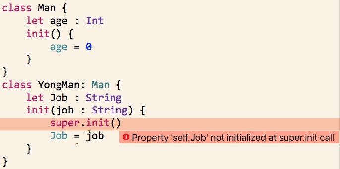
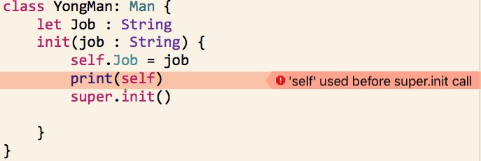
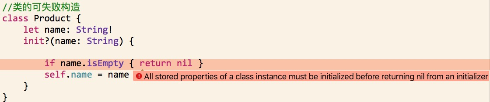

#构造过程


通过定义构造器（Initializers）来实现构造过程，这些构造器可以看做是用来创建特定类型新实例的特殊方法。与 Objective-C 中的构造器不同，Swift 的构造器无需返回值，它们的主要任务是保证新实例在第一次使用前完成正确的初始化。

类的实例也可以通过定义析构器（deinitializer）在实例释放之前执行特定的清除工作。


##存储属性的初始赋值

类和结构体在创建实例时，必须为所有存储型属性设置合适的初始值。存储型属性的值不能处于一个未知的状态。

你可以在构造器中为存储型属性赋初值，也可以在定义属性时为其设置默认值。

>当你为存储型属性设置默认值或者在构造器中为其赋值时，它们的值是被直接设置的，不会触发任何属性观察者。


###构造器

构造器在创建某个特定类型的新实例时被调用。

```
init() {
// 在此处执行构造过程
}
```
这个结构体定义了一个不带参数的构造器init，并在里面将存储型属性temperature的值初始化为32.0（华氏温度下水的冰点）。

```
struct Fahrenheit {
    var temperature: Double
    init() {
        temperature = 32.0
    }
}
var f = Fahrenheit()
print("The default temperature is \(f.temperature)° Fahrenheit")
// 输出 "The default temperature is 32.0° Fahrenheit”
```

###默认属性值

你可以在构造器中为存储型属性设置初始值。同样，你也可以在属性声明时为其设置默认值。

>
如果一个属性总是使用相同的初始值，那么为其设置一个默认值比每次都在构造器中赋值要好。两种方法的效果是一样的，只不过使用默认值让属性的初始化和声明结合得更紧密。使用默认值能让你的构造器更简洁、更清晰，且能通过默认值自动推导出属性的类型；同时，它也能让你充分利用默认构造器、构造器继承等特性（后续章节将讲到）。

```
struct Fahrenheit {
    var temperature = 32.0
}
```
##自定义构造过程
你可以通过输入参数和可选类型的属性来自定义构造过程，也可以在构造过程中修改常量属性。
###构造参数
自定义构造过程时，可以在定义中提供构造参数，指定所需值的类型和名字。构造参数的功能和语法跟函数和方法的参数相同。

下面例子中定义了一个包含摄氏度温度的结构体Celsius。它定义了两个不同的构造器：init(fromFahrenheit:)和init(fromKelvin:)，二者分别通过接受不同温标下的温度值来创建新的实例：

```
struct Celsius {
    var temperatureInCelsius: Double
    init(fromFahrenheit fahrenheit: Double) {
        temperatureInCelsius = (fahrenheit - 32.0) / 1.8
    }
    init(fromKelvin kelvin: Double) {
        temperatureInCelsius = kelvin - 273.15
    }
}
let boilingPointOfWater = Celsius(fromFahrenheit: 212.0)
// boilingPointOfWater.temperatureInCelsius 是 100.0
let freezingPointOfWater = Celsius(fromKelvin: 273.15)
// freezingPointOfWater.temperatureInCelsius 是 0.0”
```
###参数的内部名称和外部名称

跟函数和方法参数相同，构造参数也拥有一个在构造器内部使用的参数名字和一个在调用构造器时使用的外部参数名字。

然而，构造器并不像函数和方法那样在括号前有一个可辨别的名字。因此在调用构造器时，主要通过构造器中的参数名和类型来确定应该被调用的构造器。正因为参数如此重要，如果你在定义构造器时没有提供参数的外部名字，Swift 会为每个构造器的参数自动生成一个跟内部名字相同的外部名。

Color提供了一个构造器，其中包含三个Double类型的构造参数。Color也可以提供第二个构造器，它只包含名为white的Double类型的参数，它被用于给上述三个构造参数赋予同样的值。

```
struct Color {
    let red, green, blue: Double
    init(red: Double, green: Double, blue: Double) {
        self.red   = red
        self.green = green
        self.blue  = blue
    }
    init(white: Double) {
        red   = white
        green = white
        blue  = white
    }
}
```

如果不通过外部参数名字传值，你是没法调用这个构造器的。只要构造器定义了某个外部参数名，你就必须使用它，忽略它将导致编译错误：

```
let veryGreen = Color(0.0, 1.0, 0.0)
// 报编译时错误，需要外部名称
```

###不带外部名的构造器参数
如果你不希望为构造器的某个参数提供外部名字，你可以使用下划线(_)来显式描述它的外部名，以此重写上面所说的默认行为。

```
struct Color {
    let red, green, blue: Double
    init(_ red: Double, _ green: Double, _ blue: Double) {
        self.red   = red
        self.green = green
        self.blue  = blue
    }
}
```
```
let magenta1 = Color(red: 1.0, green: 0.0, blue: 1.0)//错误
let magenta2 = Color(1.0,0.0,1.0)//正确
```
###可选属性类型
如果你定制的类型包含一个逻辑上允许取值为空的存储型属性——无论是因为它无法在初始化时赋值，还是因为它在之后某个时间点可以赋值为空——你都需要将它定义为可选类型optional type。可选类型的属性将自动初始化为nil，表示这个属性是有意在初始化时设置为空的。

```
class SurveyQuestion {
    var text: String
    var response: String?-->我是可选类型
    init(text: String) {
        self.text = text
    }
    func ask() {
        print(text)
    }
}
let cheeseQuestion = SurveyQuestion(text: "Do you like cheese?")
cheeseQuestion.ask()
// 输出 "Do you like cheese?"
cheeseQuestion.response = "Yes, I do like cheese."
```
###构造过程中常量属性的修改

你可以在构造过程中的任意时间点修改常量属性的值，只要在构造过程结束时是一个确定的值。一旦常量属性被赋值，它将永远不可更改。

>
对于类的实例来说，它的常量属性只能在定义它的类的构造过程中修改；不能在子类中修改。

你可以修改上面的SurveyQuestion示例，用常量属性替代变量属性text，表示问题内容text在SurveyQuestion的实例被创建之后不会再被修改。尽管text属性现在是常量，我们仍然可以在类的构造器中设置它的值：

```
class SurveyQuestion {
    let text: String
    var response: String?
    init(text: String) {
        self.text = text
    }
    func ask() {
        print(text)
    }
}
let beetsQuestion = SurveyQuestion(text: "How about beets?")
beetsQuestion.ask()
// 输出 "How about beets?"
beetsQuestion.response = "I also like beets. (But not with cheese.)"
```

##默认构造器
如果结构体或类的所有属性都有默认值，同时没有自定义的构造器，那么 Swift 会给这些结构体或类提供一个默认构造器。这个默认构造器将简单地创建一个所有属性值都设置为默认值的实例。

```
class ShoppingListItem {
    var name: String?
    var quantity = 1
    var purchased = false
}
var item = ShoppingListItem()//拥有默认构造器
```
###结构体的逐一成员构造器
除了上面提到的默认构造器，如果结构体没有提供自定义的构造器，它们将自动获得一个逐一成员构造器，即使结构体的存储型属性没有默认值。

逐一成员构造器是用来初始化结构体新实例里成员属性的快捷方法。我们在调用逐一成员构造器时，通过与成员属性名相同的参数名进行传值来完成对成员属性的初始赋值。

```
struct Size {
    var width = 0.0, height = 0.0
}
let twoByTwo = Size(width: 2.0, height: 2.0)
```
```
struct Size {
    var width : Double, height : Double
}
let twoByTwo = Size(width: 2.0, height: 2.0)
```

##值类型的构造器代理

构造器可以通过调用其它构造器来完成实例的部分构造过程。这一过程称为构造器代理，它能减少多个构造器间的代码重复。

构造器代理的实现规则和形式在值类型和类类型中有所不同。值类型（结构体和枚举类型）不支持继承，所以构造器代理的过程相对简单，因为它们只能代理给提供给它的构造器。类则不同，它可以继承自其它类（请参考继承），这意味着类有责任保证其所有继承的存储型属性在构造时也能正确的初始化。这些责任将在后续章节类的继承和构造过程中介绍。

对于值类型，你可以使用self.init在自定义的构造器中引用类型中的其它构造器。并且你只能在构造器内部调用self.init。

如果你为某个值类型定义了一个自定义的构造器，你将无法访问到默认构造器（如果是结构体，还将无法访问逐一成员构造器）。这个限制可以防止你为值类型定义了一个进行额外必要设置的复杂构造器之后，别人还是错误地使用了一个自动生成的构造器。

```
struct Rect {
    var origin = Point()
    var size = Size()
    init() {}
    init(origin: Point, size: Size) {
        self.origin = origin
        self.size = size
    }
    init(center: Point, size: Size) {
        let originX = center.x - (size.width / 2)
        let originY = center.y - (size.height / 2)
        self.init(origin: Point(x: originX, y: originY), size: size)
    }
}
```

>
假如你希望默认构造器、逐一成员构造器以及你自己的自定义构造器都能用来创建实例，可以将自定义的构造器写到扩展（extension）中，而不是写在值类型的原始定义中。


##类的继承和构造过程

类里面的所有存储型属性——包括所有继承自父类的属性——都必须在构造过程中设置初始值。Swift 为类类型提供了两种构造器来确保实例中所有存储型属性都能获得初始值，它们分别是指定构造器和便利构造器。

###指定构造器和便利构造器

指定构造器是类中最主要的构造器。一个指定构造器将初始化类中提供的所有属性，并根据父类链往上调用父类的构造器来实现父类的初始化。每一个类都必须拥有至少一个指定构造器。在某些情况下，许多类通过继承了父类中的指定构造器而满足了这个条件。

便利构造器是类中比较次要的、辅助型的构造器。你可以定义便利构造器来调用同一个类中的指定构造器，并为其参数提供默认值。你也可以定义便利构造器来创建一个特殊用途或特定输入值的实例。

你应当只在必要的时候为类提供便利构造器，比方说某种情况下通过使用便利构造器来快捷调用某个指定构造器，能够节省更多开发时间并让类的构造过程更清晰明了。

###指定构造器和便利构造器的语法

类的指定构造器的写法：

```
init(parameters) {
    statements
}
```
便利构造器也采用相同样式的写法，但需要在init关键字之前放置convenience关键字，并使用空格将它们俩分开：

```
convenience init(parameters) {
    statements
}
```
###类的构造器代理规则

* 指定构造器必须调用其直接父类的的指定构造器。

* 便利构造器必须调用同一类中定义的其它构造器。

* 便利构造器必须最终导致一个指定构造器被调用。

>
	指定构造器必须总是向上代理，便利构造器必须总是横向代理
	


###两段式构造过程

Swift 中类的构造过程包含两个阶段。第一个阶段，每个存储型属性通过引入它们的类的构造器来设置初始值。当每一个存储型属性值被确定后，第二阶段开始，它给每个类一次机会在新实例准备使用之前进一步定制它们的存储型属性。

两段式构造过程的使用让构造过程更安全，同时在整个类层级结构中给予了每个类完全的灵活性。两段式构造过程可以防止属性值在初始化之前被访问，也可以防止属性被另外一个构造器意外地赋予不同的值。


Swift 编译器将执行 4 种有效的安全检查，以确保两段式构造过程能顺利完成：

* 安全检查 1

	指定构造器必须保证它所在类引入的所有属性都必须先初始化完成，之后才能将其它构造任务向上代理给父类中的构造器。
	
	
* 安全检查 2

	指定构造器必须先向上代理调用父类构造器，然后再为继承的属性设置新值。如果没这么做，指定构造器赋予的新值将被父类中的构造器所覆盖。

* 安全检查 3

	便利构造器必须先代理调用同一类中的其它构造器，然后再为任意属性赋新值。如果没这么做，便利构造器赋予的新值将被同一类中其它指定构造器所覆盖。

* 安全检查 4

	构造器在第一阶段构造完成之前，不能调用任何实例方法，不能读取任何实例属性的值，不能引用self作为一个值。

	
-
####构造流程：

#####阶段 1(当到达了构造器链最顶部之前)

* 某个指定构造器或便利构造器被调用。
* 完成新实例内存的分配，但此时内存还没有被初始化。
* 指定构造器确保其所在类引入的所有存储型属性都已赋初值。存储型属性所属的内存完成初始化。
* 指定构造器将调用父类的构造器，完成父类属性的初始化。
* 这个调用父类构造器的过程沿着构造器链一直往上执行，直到到达构造器链的最顶部。
* 当到达了构造器链最顶部，且已确保所有实例包含的存储型属性都已经赋值，这个实例的内存被认为已经完全初始化。此时阶段 1 完成。

#####阶段 2(当到达了构造器链最顶部之后)

* 从顶部构造器链一直往下，每个构造器链中类的指定构造器都有机会进一步定制实例。构造器此时可以访问self、修改它的属性并调用实例方法等等。
* 最终，任意构造器链中的便利构造器可以有机会定制实例和使用self。

---


1. 指定构造器将确保所有子类的属性都有值。然后它将调用父类的指定构造器，并沿着构造器链一直往上完成父类的构造过程。

2. 父类中的指定构造器确保所有父类的属性都有值。由于没有更多的父类需要初始化，也就无需继续向上代理。

3. 一旦父类中所有属性都有了初始值，实例的内存被认为是完全初始化，阶段 1 完成。


1. 父类中的指定构造器现在有机会进一步来定制实例（尽管这不是必须的）。

2. 一旦父类中的指定构造器完成调用，子类中的指定构造器可以执行更多的定制操作（这也不是必须的）。

3. 最终，一旦子类的指定构造器完成调用，最开始被调用的便利构造器可以执行更多的定制操作。

###构造器的继承和重写

Swift 中的子类默认情况下不会继承父类的构造器。Swift 的这种机制可以防止一个父类的简单构造器被一个更专业的子类继承，并被错误地用来创建子类的实例。

* 当你重写一个父类的指定构造器时，你总是需要写override修饰符，即使你的子类将父类的指定构造器重写为了便利构造器。override修饰符会让编译器去检查父类中是否有相匹配的指定构造器，并验证构造器参数是否正确。
	
* 重写父类的便利构造器不需要加override，__由于子类不能直接调用父类的便利构造器__，因此，严格意义上来讲，你的子类并未对一个父类构造器提供重写。

>子类可以在初始化时修改继承来的变量属性，但是不能修改继承来的常量属性。

###构造器的自动继承

* 如果子类没有定义任何指定构造器，它将自动继承所有父类的指定构造器。

* 如果子类提供了所有父类指定构造器的实现——无论是通过规则 1 继承过来的，还是提供了自定义实现——它将自动继承所有父类的便利构造器。（即使属性没有默认值，只要实现了父类的所有指定构造器，就会自动继承父类的所有便利构造器）

>对于规则 2，子类可以将父类的指定构造器实现为便利构造器。


###指定构造器和便利构造器实践 


##可失败构造器

如果一个类、结构体或枚举类型的对象，在构造过程中有可能失败，如给构造器传入无效的参数值，或缺少某种所需的外部资源，又或是不满足某种必要的条件等。
你可以在一个类，结构体或是枚举类型的定义中，添加一个或多个可失败构造器。其语法为在init关键字后面加添问号(init?)。

>可失败构造器的参数名和参数类型，不能与其它非可失败构造器的参数名，及其参数类型相同

可失败构造器会创建一个类型为自身类型的可选类型的对象。你通过return nil语句来表明可失败构造器在何种情况下应该“失败”。

```
struct Animal {
    let species: String
    init?(species: String) {
        if species.isEmpty { return nil }
        self.species = species
    }
}
```
```
let someCreature = Animal(species: "Giraffe")
// someCreature 的类型是 Animal? 而不是 Animal

if let giraffe = someCreature {
    print("An animal was initialized with a species of \(giraffe.species)")
}
// 打印 "An animal was initialized with a species of Giraffe"

let anonymousCreature = Animal(species: "")
// anonymousCreature 的类型是 Animal?, 而不是 Animal

if anonymousCreature == nil {
    print("The anonymous creature could not be initialized")
}
// 打印 "The anonymous creature could not be initialized"
```

###枚举类型的可失败构造器

你可以通过一个带一个或多个参数的可失败构造器来获取枚举类型中特定的枚举成员。如果提供的参数无法匹配任何枚举成员，则构造失败。


```
enum TemperatureUnit {
    case Kelvin, Celsius, Fahrenheit
    init?(symbol: Character) {
        switch symbol {
        case "K":
            self = .Kelvin
        case "C":
            self = .Celsius
        case "F":
            self = .Fahrenheit
        default:
            return nil
        }
    }
}
```

###带原始值的枚举类型的可失败构造器

带原始值的枚举类型会自带一个可失败构造器init?(rawValue:)，该可失败构造器有一个名为rawValue的参数，其类型和枚举类型的原始值类型一致，如果该参数的值能够和某个枚举成员的原始值匹配，则该构造器会构造相应的枚举成员，否则构造失败。


###类的可失败构造器

值类型（也就是结构体或枚举）的可失败构造器，可以在构造过程中的任意时间点触发构造失败。而对类而言，___可失败构造器只能在类引入的所有存储型属性被初始化后，以及构造器代理调用完成后，才能触发构造失败。___

```
class Product {
    let name: String!
    init?(name: String) {
        self.name = name
        if name.isEmpty { return nil }
    }
}
```

 

###构造失败的传递


类，结构体，枚举的可失败构造器可以横向代理到类型中的其他可失败构造器。类似的，子类的可失败构造器也能向上代理到父类的可失败构造器。

无论是向上代理还是横向代理，如果你代理到的其他可失败构造器触发构造失败，整个构造过程将立即终止，接下来的任何构造代码不会再被执行。

```
class CartItem: Product {
    let quantity: Int!
    init?(name: String, quantity: Int) {
        self.quantity = quantity
        super.init(name: name)
        if quantity < 1 { return nil }
    }
}
```
__只有构造一个name的值为非空字符串，quantity的值不小于1的CartItem实例才能成功__

###重写一个可失败构造器

可以在子类中重写父类的可失败构造器。或者你也可以用子类的非可失败构造器重写一个父类的可失败构造器。这使你可以定义一个不会构造失败的子类，即使父类的构造器允许构造失败。

当你用子类的非可失败构造器重写父类的可失败构造器时，向上代理到父类的可失败构造器的唯一方式是对父类的可失败构造器的返回值进行强制解包。

>__你可以用非可失败构造器重写可失败构造器，但反过来却不行。__

```
class Document {
    var name: String?
    // 该构造器创建了一个 name 属性的值为 nil 的 document 实例
    init() {}
    // 该构造器创建了一个 name 属性的值为非空字符串的 document 实例
    init?(name: String) {
        self.name = name
        if name.isEmpty { return nil }
    }
}
```

这个子类重写了父类的两个指定构造器，确保了无论是使用init()构造器，还是使用init(name:)构造器并为参数传递空字符串，生成的实例中的name属性总有初始"[Untitled]"：

```
class AutomaticallyNamedDocument: Document {
    override init() {
        super.init()
        self.name = "[Untitled]"
    }
    override init(name: String) {
        super.init()
        if name.isEmpty {
            self.name = "[Untitled]"
        } else {
            self.name = name
        }
    }
}
```

你可以在子类的非可失败构造器中使用强制解包来调用父类的可失败构造器。

```
class UntitledDocument: Document {
    override init() {
        super.init(name: "[Untitled]")!
    }
}
```

###可失败构造器 init!

通常来说我们通过在init关键字后添加问号的方式（init?）来定义一个可失败构造器，但你也可以通过在init后面添加惊叹号的方式来定义一个可失败构造器（(init!)），该可失败构造器将会构建一个对应类型的隐式解包可选类型的对象。

你可以在init?中代理到init!，反之亦然。你也可以用init?重写init!，反之亦然。你还可以用init代理到init!，不过，一旦init!构造失败，则会触发一个断言。

##必要构造器

在类的构造器前添加required修饰符表明所有该类的子类都必须实现该构造器：

```
class SomeClass {
    required init() {
        // 构造器的实现代码
    }
}
```

子类重写父类的必要构造器时，必须在子类的构造器前也添加required修饰符，表明该构造器要求也应用于继承链后面的子类。在重写父类中必要的指定构造器时，不需要添加override修饰符：

```
class SomeSubclass: SomeClass {
    required init() {
        // 构造器的实现代码
    }
}
```

>如果子类继承的构造器能满足必要构造器的要求，则无须在子类中显式提供必要构造器的实现。


##通过闭包或函数设置属性的默认值

某个存储型属性的默认值需要一些定制或设置，你可以使用闭包或全局函数为其提供定制的默认值。每当某个属性所在类型的新实例被创建时，对应的闭包或函数会被调用，而它们的返回值会当做默认值赋值给这个属性。

这种类型的闭包或函数通常会创建一个跟属性类型相同的临时变量，然后修改它的值以满足预期的初始状态，最后返回这个临时变量，作为属性的默认值。

```
class SomeClass {
    let someProperty: SomeType = {
        // 在这个闭包中给 someProperty 创建一个默认值
        // someValue 必须和 SomeType 类型相同
        return someValue
    }()
}
```
__注意闭包结尾的大括号后面接了一对空的小括号。这用来告诉 Swift 立即执行此闭包。如果你忽略了这对括号，相当于将闭包本身作为值赋值给了属性，而不是将闭包的返回值赋值给属性。__


>如果你使用闭包来初始化属性，请记住在闭包执行时，实例的其它部分都还没有初始化。这意味着你不能在闭包里访问其它属性，即使这些属性有默认值。同样，你也不能使用隐式的self属性，或者调用任何实例方法。
